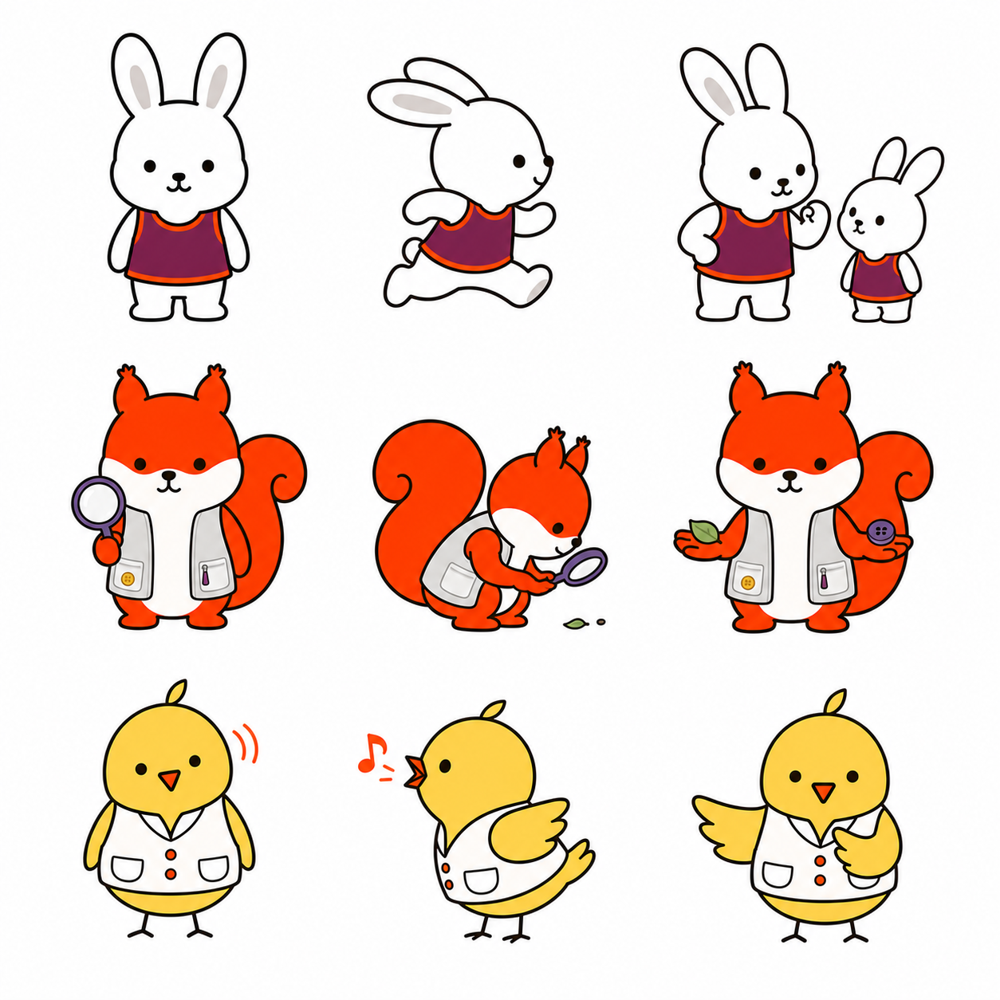
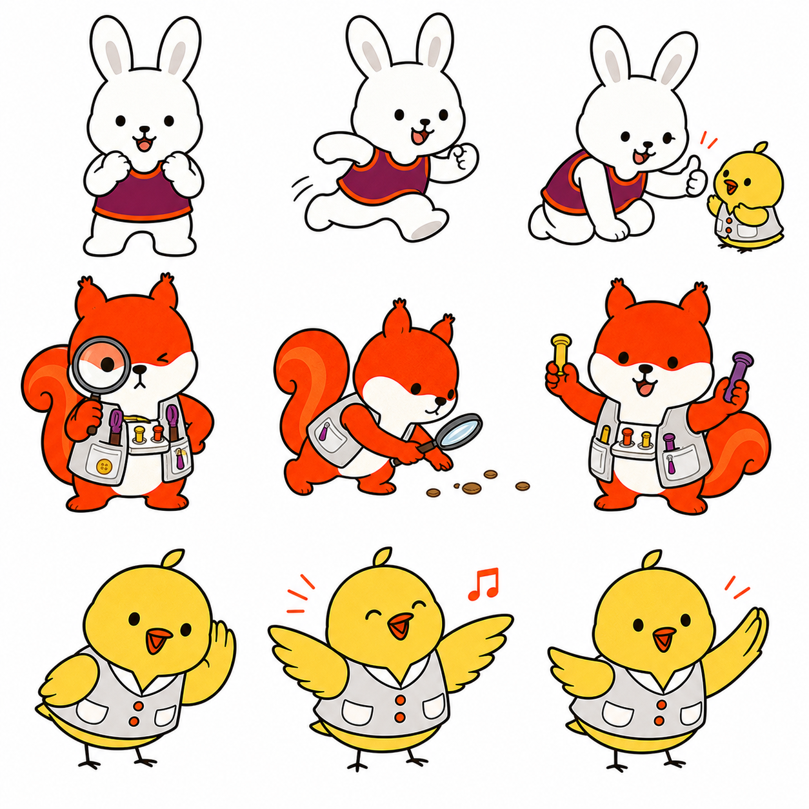
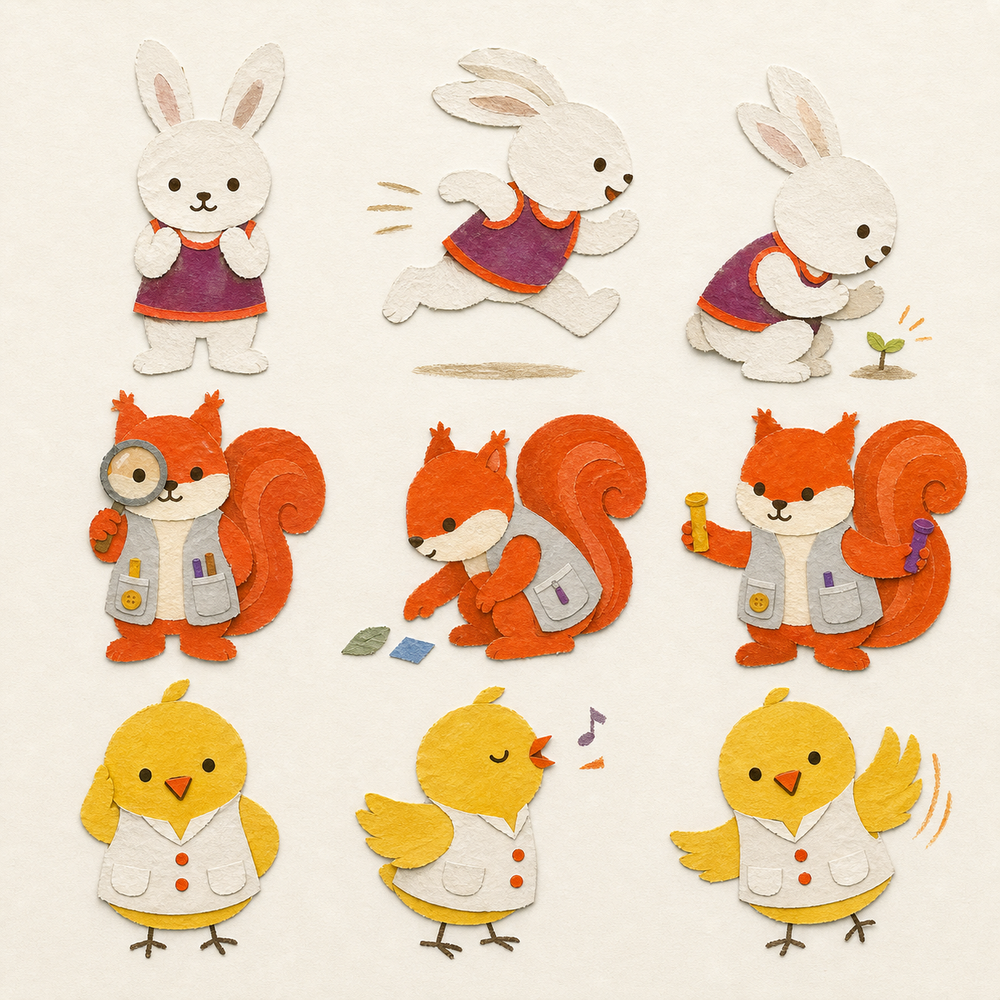

# HugMap Stories キャラクター表現ガイド

作成日: 2026-07-23  
対象: 動物の先生たちの仕草、動き、発言、道具、感情表現
役割: **キャラクターの行動・会話・道具の正本**

## 1. このガイドの目的

本書は、各キャラクターの専門性を長い説明ではなく、絵本の中で観察できる行動として表すためのガイドである。

次の要素を定義する。

- よくする仕草
- 身体の動かし方
- 子どもとの距離の取り方
- 感情が現れる場所
- 発言の長さと口調
- 発言をする目的
- 象徴的な道具
- 場所や物語に応じて追加する道具

## 2. 共通原則――言葉より先に、行動で示す

すべての動物が、言葉を主要な表現手段にする必要はない。

先生たちは、次の順序で子どもと関わる。

```text
見る
↓
身体、距離、表情、道具で応じる
↓
子どもの反応を待つ
↓
必要なときだけ、短い言葉を添える
```

長い説明は、絵本本文ではなくあとがきへ分ける。

### 2.1 言葉を使う目的

先生の発言には、必ず次のいずれかの意図を持たせる。

- 子どもの表現を受け取る。
- 子どもの表現をまねて、届いたことを返す。
- 本人へ意味を確かめる。
- 選択肢を示し、本人が選べるようにする。
- 感情や感覚へ短い名前を添える。
- 次に起きることを予告する。
- 観察した事実を保護者と共有する。
- 仮説を一つに決めず、問いとして残す。
- 安全や相談の必要性を伝える。
- 家、園、学校、支援者の間で情報を渡す。

### 2.2 避ける発言

- 正解を一方的に教える長い講義。
- 子どもへ同じ発語を何度も要求する質問。
- 答えが決まっているテスト形式の問い。
- 「できたら渡す」など、発語や視線を報酬の条件にする言葉。
- 感情をすぐポジティブに置き換える励まし。
- 「頑張ればできる」「好き嫌いを克服しよう」など、努力不足を示唆する言葉。
- 子どもの内面や医学的原因を断定する言葉。

### 2.3 非言語表現を優先する場面

- 子どもが集中しているとき。
- 子どもが疲れている、緊張している、圧倒されているとき。
- 相手の返事を待っているとき。
- 同じ遊びへ加わるとき。
- 悲しみや不安へ寄り添うとき。
- 先生自身が見本を見せるとき。

## 3. 関連する正本

このガイドでは世界観と場所を再定義しない。

- シリーズの価値観、先生の核、チーム関係：[`world-and-character-guide.md`](world-and-character-guide.md)
- HugMapの家、遊びの場所、担当動物：[`world-space-story-map.md`](world-space-story-map.md)
- 顔、視線、眉、口の描画基準：[`character-facial-expression-reference.md`](character-facial-expression-reference.md)

本書は、それらの設定を絵本内の仕草、動き、距離、発言、道具へ翻訳する。

## 4. ことり先生――傾聴、模倣、会話を生む

### キャラクターの核

> みんなには聞こえにくい声や、まだ言葉になっていない仕草を聞くことができる。

ことり先生の前では、子どもも保護者もつい話したくなる。歌、声、仕草、視線、表情、AACをすべて会話の入口として扱う。

### 言葉以外の表現

- 相手のほうへ小さく首を傾ける。
- 聞くとき、羽根を身体の前で静かに重ねる。
- 返事をする前に、一度まばたきをして待つ。
- 子どもの声、表情、手の動きを小さくまねる。
- 相手が何かを伝えようとした瞬間、微笑みながら小さくうなずく。
- 子どもの正面を塞がず、斜め横または同じ高さへ移動する。
- 「どっち？」を示すとき、左右の羽根を開く。
- うれしいと羽根をぱたぱたさせる。
- 驚くと頭の羽根が立つ。
- 悲しい相手には、身体を少し丸くして隣に座る。
- 触れる前に羽根を差し出し、本人の反応を確かめる。

「ぎゅう」や「なでなで」は自動的に行わず、本人が選べるようにする。

> 「ぎゅうする？」  
> 「となりにいる？」  
> 「おうたにする？」

### 発言の目的

ことり先生の言葉は、子どもの言葉やコミュニケーションを引き出すために使う。ただし、発語を強制しない。

#### ミラーリング

子どもの声、単語、リズム、仕草を小さく返し、「届いた」経験を作る。

> 子ども「あー」  
> ことり先生「あー」

同じ音を完全にコピーするのではなく、表情や間を含めて返す。

#### 受容と会話の継続

> 「うん、うん」  
> 「そうだったんだ」  
> 「続きをきかせて」  
> 「きみの声、届いたよ」

#### 意図を確かめる質問

> 「これを伝えたい？」  
> 「もういっかい、かな？」  
> 「いまの声は、ママに届けたのかな？」

答えを決めつけず、質問のあとに十分な間を置く。

#### 選べる質問

> 「こっちと、こっち。どっちがよい？」  
> 「声でいう？ カードでいう？」  
> 「ぎゅうする？ となりにいる？」

選択肢を増やしすぎない。どちらも選ばないことも認める。

#### 拡張

子どもの一語や仕草へ、少しだけことばを足す。

> 子ども「でんしゃ」  
> ことり先生「でんしゃ、きたね」

子どもの発言を訂正するのではなく、会話を一歩だけ広げる。

#### 歌と予測

歌や決まったリズムを使い、子どもが声、仕草、視線で参加できる間を作る。

歌い切らず、参加を待つ空白を残す。ただし、参加しなくても歌や活動を取り上げない。

#### 口遊びと音の往復

息を吹く、唇を鳴らす、舌を動かす、音の長さや高さを変えるなどの口遊びを、正しい発音の練習ではなく「まねしたくなる遊び」として見せる。

> 「ふーってする？ ぶるるってする？」
> 「いまの音、もういっかい聞かせて」

ことり先生が先に楽しみ、子どもが声、表情、視線、身振りのどれで返しても会話として受け取る。

### 発声について見ること

```text
息を送る
↓
喉で音が生まれる
↓
口、舌、唇で音が変わる
↓
高さ、長さ、強さ、リズムが加わる
↓
相手へ向けられ、コミュニケーションになる
```

観察するもの:

- 声の長さ、強さ、高さ、リズム。
- 声を出す前後の表情と視線。
- 誰へ向けた声か。
- 相手が返すと、もう一度声を出すか。
- 声と身振り、視線、AACをどう組み合わせているか。

### 象徴道具

- 二つの吹き出し。
- 小さなベルまたは音叉。
- AACや絵カードを入れた薄い歌集。
- 声、視線、会話の往復を表す柔らかなリボン。

一番大切な道具は「待つ時間」である。

## 5. りす先生――感覚を探険し、参加できる形を作る

### キャラクターの核

> 手先が器用で好奇心旺盛。子どもの身体が感じているものを探険し、少しでも参加できる方法を発明する。

試したい気持ちは強いが、子どものテンションや反応を見るときは冷静になる。

### 言葉以外の表現

- 気になる物を両手で持ち、表裏、重さ、手触りを確かめる。
- 目を大きくして周囲を見回し、音、光、匂いの出どころを探す。
- 初めての素材は、触る前に少し離れて見たり、匂いを確かめたりする。
- 考えるとき、尻尾の先を指で整える。
- 子どもの動きを、自分の指や手で小さく試す。
- 手と目を一緒に使う遊びでは、道具の位置や大きさを少しずつ変える。
- 道具箱を開け、出しすぎたと気づいて半分戻す。
- 子どもの緊張が上がると、自分の声と動きをゆっくりにする。
- 道具を直接手渡さず、本人が選べる位置へ置く。
- 観察が始まると、動いていた尻尾が静かになる。

### 発言の目的

りす先生の言葉は、感覚を断定するためではなく、試せる選択肢と参加方法を作るために使う。

#### 感覚への名前づけ

> 「ざらざらしているね」  
> 「ぎゅっとすると、分かりやすい？」  
> 「音と、手の感じ、どっちが好きかな」

#### 参加方法の提案

> 「見るだけにする？」  
> 「ここだけ一緒にやってみる？」  
> 「ぼくが持つ？ きみが押す？」

#### 調整の提案

> 「もっと小さくできるかも」  
> 「少し静かな場所で試そう」  
> 「道具を一つにしてみよう」

音量、明るさ、匂い、物の数、周囲との距離も「道具」と同じように調整する。

> 「どの音がむずかしい？」
> 「こっちの場所なら、どう感じる？」
> 「少しだけ音を小さくしてみよう」

#### 仮説を開いておく

> 「身体が探しているものがあるのかも」  
> 「同じ動きでも、理由は一つじゃないね」

### 象徴道具

- あふれそうな道具箱。
- 布、ブラシ、粘土。
- トング、ペグ、洗濯ばさみ。
- 大きさや重さの異なるボール。
- 「見るだけ」「少し触る」「一緒にする」の参加カード。

## 6. うさぎ先生――身体で遊び、小さな挑戦を応援する

### キャラクターの核

> 外遊びと身体遊びをたくさん知っている応援係。難しい動きを、小さく試せる楽しい遊びへ変える。

ブランコ、ボール、トランポリン、滑り台、でんぐり返しが好き。自分も徐々に上達する努力派である。

### 言葉以外の表現

- 挑戦する前に、自分が「頑張るポーズ」をする。
- 子どもの一歩が見えると、手をたたいて喜ぶ。
- 遊びを思いつくと両耳が立つ。
- 身体を動かす楽しさを誘うとき、ぴょんぴょん小さく跳ねる。
- 疲れた子を見つけると、耳がゆっくり下がる。
- 子どもの足元を指で命令せず、自分の足で見本を示す。
- 走る、跳ぶ、転がる、ぶら下がることで遊び方を見せる。
- 子どもの速さに合わせて歩幅を変える。
- 休憩するときは、思い切って寝転ぶ。
- 自分も失敗し、立ち上がる前に休む。

### 発言の目的

うさぎ先生の言葉は、努力を要求するためではなく、身体の準備、休憩、挑戦方法を選べるようにするために使う。

#### 遊びへの招待

> 「転がす？ 蹴る？ 追いかける？」  
> 「この線まで行ってみる？」  
> 「今日は、どんな遊び方にする？」

#### 小さな段階を示す

> 「まず、ここまで」  
> 「次は一段だけ」  
> 「昨日と違う遊びを一つ足してみる？」

バランス、筋力、持続力を一度に求めず、一つずつ遊びへ変える。途中でやめることや休むことも、その子が身体を分かってきたサインとして扱う。

#### 休憩と身体の確認

> 「休んでから、もう一回」  
> 「耳も足も、ちょっと疲れたみたい」  
> 「続ける？ 休む？」

#### 応援

> 「速さじゃなくて、きみの一歩を見せて」  
> 「自分で止まれたね」  
> 「できる形を探しにいこう」

「頑張れ」を繰り返さず、本人が選んだ挑戦を応援する。

### 象徴道具

- 黄色いボール。
- 足跡。
- 短いロープ。
- お休みカード。
- チョーク。
- 遊び方を描いた巻物。

## 7. ふくろう先生――前後を並べ、理由を考える

### キャラクターの核

> ロジカルな探偵。行動の瞬間だけでなく、その前とあと、起きなかった日を並べて考える。

冷たい分析役ではなく、感情へ共感したうえで状況を整理する。

### 言葉以外の表現

- 考えるとき、眉の上の羽根を整える。
- 首を少し傾ける。
- カードを何度も並べ替える。
- 新しい事実が出ると眼鏡を上げる。
- 結論を急ぐ人がいると、羽根を一枚静かに上げる。
- 上から全体を眺めたあと、子どもの高さへ戻る。
- 納得すると、カードを一度だけ「とん」と揃える。

### 発言の目的

ふくろう先生の言葉は、原因を追及して一つに決めるためではなく、観察可能な事実を整理し、試せる仮説を作るために使う。

#### 時間をつなぐ

> 「その前には、何があった？」  
> 「そのあと、どうなった？」  
> 「昨日の同じ時間はどうだった？」

#### 比較する

> 「起きなかった日は、何が違った？」  
> 「似ているところと、違うところを並べよう」

#### 仮説を開く

> 「まだ答えは一つにしないでおこう」  
> 「理由は、いくつか重なっているかもしれない」

#### 感情を受け止める

> 「突然に見えて、びっくりしたね」  
> 「分からないままなのは、心配だよね」

### 象徴道具

- 「まえ・いま・あと」の三枚カード。
- 虫眼鏡。
- 一週間の巻物。
- 月明かりで見える鉛筆。
- 仮説をつなぐ糸。

## 8. ぞう先生――見えないことを描き、選べる道を作る

### キャラクターの核

> ビジュアルが得意なアーティスト。ことばだけでは分かりにくい予定、順番、選択肢、終わりを見える形にする。

規則や予定を好むが、子どもへ同じ規則を強制するのではない。ぞう先生自身は予定変更に少し弱く、チームに助けられる。

### 言葉以外の表現

- 話を聞きながら空中へ図を描く。
- 鼻でカードを順番に並べる。
- 予定が決まると鼻を丸める。
- 予定変更が起きると、鼻が一度固まる。
- 子どもが選ぶと、その場所に色を加える。
- 大きな紙を広げすぎ、みんなの場所を取ってしまう。
- 変更があると、古い地図を捨てず、新しい道を描き足す。

### 発言の目的

ぞう先生の言葉は、指示どおりに動かすためではなく、理解、選択、見通し、変更への準備を助けるために使う。

#### 現在地を示す

> 「いまは、ここ」  
> 「あと一つで、おわり」

#### 選択を見えるようにする

> 「次は、どっちにする？」  
> 「休む道も、地図に入れよう」

#### 変更を伝える

> 「予定が変わったよ」  
> 「変更も、地図に描ける」  
> 「新しい道を一緒に作ろう」

#### 学び方を増やす

> 「同じゴールへ、別の道を描こう」  
> 「見本を見る？ 一緒にやる？」

### 象徴道具

- 大きなスケッチブック。
- 太い色鉛筆。
- 「いま・つぎ・おわり」カード。
- 選択カード。
- タイマー。
- 消して描き直せる地図。

## 9. くま先生――身体を守り、いつもとの違いを見る

### キャラクターの核

> 身体のことをよく知る慎重派。子どもの「いつも」と「今日」を比べ、安全と相談の必要性を確かめる。

### 言葉以外の表現

- 話を聞きながら両手をお腹の前で重ねる。
- 子どもの高さまでゆっくり腰を下ろす。
- 急がせる人がいると、身体で静かに前へ出る。
- 休みたい子へ毛布を持ってくる。
- 小さな帳面で「いつも」と「今日」を見比べる。
- 安全に関わるときだけ素早く動く。
- 分からないときは、無理に答えを作らない。

### 発言の目的

くま先生の言葉は、不安を大きくするためではなく、身体の変化を整理し、安全な次の行動へつなぐために使う。

#### いつもとの比較

> 「いつもと、どこが違う？」  
> 「眠り、食事、遊び方も一緒に見よう」

#### 安心と休息

> 「今日は身体の声を先に聞こう」  
> 「休むことも大事だよ」

#### 不確実さを共有する

> 「まだ分からないから、一緒に確かめよう」  
> 「行動だけでは決められないね」

#### 相談へつなぐ

> 「これは、詳しい人にも見てもらおう」  
> 「気づいたことを、そのまま伝えよう」

### 象徴道具

- 聴診器。
- 「いつも」と「きょう」の比較帳。
- 柔らかい毛布。
- 体調の小さなメーター。
- 相談先を示す地図。

## 10. かば先生――食べることへ辛抱強く付き合う

### キャラクターの核

> 食べることが大好き。だからこそ、自分が好きなものを子どもへ強制せず、その子が安心して食べ物と出会える方法を探す。

「嫌いなものを克服させる先生」ではなく、見る、触る、匂う、選ぶ、断ることも含めて、食べ物との関係を少しずつ広げる先生とする。

### 言葉以外の表現

- 食べる前に香りをゆっくり嗅ぐ。
- 一口を急がず、よく味わう。
- 子どもが嫌がると、皿を少し遠ざける。
- 「見るだけ」の皿と、食べるかもしれない皿を分ける。
- 食材の形、温度、硬さを丁寧に確かめる。
- 待つときは両手を机の上で静かに重ねる。
- 安全が気になると、スプーンを置く。

### 発言の目的

かば先生の言葉は、食べさせるためではなく、安心、安全、拒否、感覚の違いを確認するために使う。

#### 拒否を受け取る

> 「今日は“いらない”なんだね」  
> 「ここに置いておく？ 片づける？」

#### 感覚を確かめる

> 「どんな匂いがする？」  
> 「この形と、この形。どっちが安心？」  
> 「冷たいのと、少し温かいの、どっちにする？」

#### 参加方法を増やす

> 「見るだけでもいいよ」  
> 「触る？ スプーンで混ぜる？」

#### 自分との違いを認める

> 「ぼくが好きでも、きみが好きとは限らないよね」

### 象徴道具

- 小さなスプーン。
- 持ち手付きカップ。
- 食感を比べる小皿。
- 足台。
- 「見る・触る・匂う・味わう」カード。
- 安全確認の布。

## 11. ぽけっとさん――気づきを残し、次へ渡す

ぽけっとさんの種族とチーム内の正式な立場は、今後決定する。

### キャラクターの核

> 家、園、学校、病院で見つかった小さな事実を預かり、時間と場所を越えて次の人へ渡す。

### 言葉以外の表現

- 大切な言葉を聞くとポケットを開く。
- 写真やカードを日付順に並べる。
- 解釈が事実のように語られると、鉛筆を止める。
- 子どもの言葉を勝手に書き換えず、そのまま残す。
- 会議の最後に、カードを渡す相手の前へ置く。
- 記録に集中しすぎると、目の前の遊びを忘れる。
- ときどきポケットから、意外な昔の写真が出てくる。

### 発言の目的

ぽけっとさんの言葉は、解釈や診断のためではなく、事実を残す、思い出す、共有するために使う。

#### 事実を残す

> 「そのまま残しておこう」  
> 「いつ、どこで起きた？」

#### 事実と解釈を分ける

> 「それは見たこと？ それとも考えたこと？」  
> 「“怒った”ではなく、何をしたか書いてみよう」

#### 思い出す手がかりを作る

> 「この写真を見る？」  
> 「このあと、何をしたっけ？」

#### 次へ渡す

> 「家ではどうだった？」  
> 「この気づきを、誰へ渡そうか」

### 象徴道具

- 大きなポケット。
- 写真。
- 記録カード。
- 鉛筆。
- 子どものロードマップ。
- 家庭と支援者をつなぐノート。

## 12. 発言量の目安

先生の性格によって、同じ量を話す必要はない。

| キャラクター | 発言量 | 主な表現 |
|---|---:|---|
| ことり先生 | 中 | ミラーリング、短い質問、選択、拡張、歌 |
| りす先生 | 少〜中 | 手で試す、道具を置く、感覚語、参加方法の提案 |
| うさぎ先生 | 少 | 身体で見本、リズム、短い招待と応援 |
| ふくろう先生 | 中 | 前後を尋ねる、比較する、仮説を整理する |
| ぞう先生 | 少〜中 | 描く、並べる、現在地と選択肢を短く示す |
| くま先生 | 少 | 安心できる存在、比較、安全、相談への短い言葉 |
| かば先生 | 少 | 待つ、皿の距離を変える、拒否と選択を受け取る |
| ぽけっとさん | 少〜中 | 事実確認、記録、想起、引き継ぎ |

## 13. 道具の三段階

### 13.1 必ず持つ象徴道具

キャラクターを一目で識別するもの。

| キャラクター | 象徴道具 |
|---|---|
| ことり先生 | 二つの吹き出し、歌集 |
| りす先生 | あふれそうな道具箱 |
| うさぎ先生 | 黄色いボール |
| ふくろう先生 | 「まえ・いま・あと」の三枚カード |
| ぞう先生 | 大きなスケッチブック |
| くま先生 | 聴診器と比較帳 |
| かば先生 | 小さなスプーン |
| ぽけっとさん | 大きなポケット |

### 13.2 場所に置く道具

毎回持ち歩かず、それぞれの空間に置く。

例: トランポリン、ブランコ、大きな画材、調理器具、静かな寝床、感覚遊具。

### 13.3 物語ごとに選ぶ道具

特定の子どもの生活場面に応じて選ぶ。

例: 足台、AAC、タイマー、特定の食器、音の筒、予定変更カード。

道具は、キャラクターを飾るためではなく、子どもが参加、選択、理解、休息、安全を得るために使う。

### 13.4 メイン3人の代表ポーズ

キャラクターを3枚で伝える場合は、全員を単純な正面・側面・背面で揃えず、次の三つを基本セットにする。

1. **基本形**――正面から見た形、色、象徴道具が分かる。
2. **見つけ方**――その先生が何に気づき、どう動くかが分かる。
3. **関わり方**――子どもとの距離、待ち方、応じ方が分かる。

| 先生 | 基本形 | 見つけ方 | 関わり方 |
|---|---|---|---|
| ことり先生 | 首を少し傾け、静かに聴く正面 | 横向きで歌う。うれしいと羽をぱたぱたさせる | 子どもの小さな仕草をまねし、羽を閉じて返事を待つ |
| りす先生 | 虫眼鏡と小さな道具箱を持つ正面 | 床へしゃがみ、手がかりを観察する | 道具を二つ差し出し、本人が選ぶのを待つ |
| うさぎ先生 | 胸の前で小さな「がんばるポーズ」 | 横向きで跳ぶ、走る、転がる | 子どもの隣で同じ高さになり、小さな一歩を応援する |

#### 画風比較の試作

以下は正式デザインではなく、ポーズと情報量を比較するための試作である。特定作品の形を再現するのではなく、参考作品から抽出した表現上の特徴を比較する。

**記号型の試作**

太い輪郭、平面色、小さな目と口、抑えた表情で構成する。縮小時の識別性と、読み手が感情を受け取る余白を検証する。



**キャラクター・アニメーション型の試作**

丸い量感、分かりやすい感情、大きなジェスチャーで構成する。役割の即時性と、スタンプや動画へ展開したときの動かしやすさを検証する。



**コラージュ・素材型の試作**

手で塗った薄紙、ちぎった輪郭、色面の重なり、紙の余白で構成する。身体性と絵本らしい温度が出る一方、縮小時には紙の繊維や細い道具が見えにくくなる。



#### 用途別の使い分け

| 用途 | 基本にする表現 | 理由 |
|---|---|---|
| 小さいアイコン | 記号型 | 縮小しても顔、色、シルエットを識別しやすい |
| LINEスタンプ | 記号型＋キャラクター・アニメーション型 | 同一性を保ちながら、感情と用件を身体で伝えやすい |
| 絵本 | 記号型＋コラージュ・素材型 | 読みやすい形と、紙・絵の具の温度を両立できる |
| 動画 | キャラクター・アニメーション型 | 関節、表情、動作の変化を設計しやすい |

現時点の有力な基本設計は、**形は記号型、仕草と関係性はキャラクター・アニメーション型、絵本の色面と背景はコラージュ・素材型**である。同じ設計図から、アイコンとスタンプは輪郭・平面色で、絵本は紙素材を加えて出力する。目と口だけで感情を説明せず、耳、羽、尻尾、姿勢、距離を使って「身体が語る」表現を優先する。

画風そのものは未決定のため、最終判断は [`open-decisions.md`](open-decisions.md) で管理する。

## 14. 場所と物語を使ったキャラクターテスト

基本設定は先に仮決定し、場所と物語を考えながら調整する。

```text
見つけ方
↓
性格
↓
仕草、動き、発言
↓
象徴道具
↓
その行動が自然に起きる場所
↓
実際の物語場面でテスト
```

### 共通テスト場面

#### 場面1

子どもが一人で石を並べている。

確認すること:

- 各先生は最初に何を見るか。
- 声をかける前に何をするか。
- 遊びへ加わるか、待つか。

#### 場面2

予定が変わり、子どもが動かなくなる。

確認すること:

- 誰が最初に前へ出るか。
- 誰が補助へ回るか。
- 言葉以外に何を変えるか。

#### 場面3

子どもが初めて先生へ玩具を見せる。

確認すること:

- 各先生はどう喜ぶか。
- 何を言い、何を言わないか。
- 子どもの行動を奪わず、どう返すか。

仕草、発言、道具がキャラクター間で入れ替え可能なら、個性を再調整する。

## 15. 今後決める情報

未決事項は [`open-decisions.md`](open-decisions.md) で一元管理する。決定後、仕草、会話、距離、道具に関わる内容だけを本書へ反映する。
