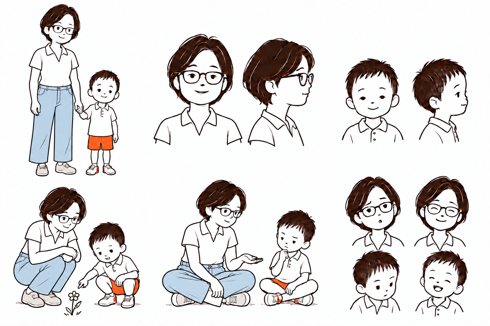

# 親子の服装と配色

母親はボタンなしの白い半袖・襟付きトップスを薄い青のデニムにイン。子どもは白いポロシャツとオレンジのショーツ。

配色指定：白 #FFFFFF、子どものオレンジ #FF511B、線・髪 #291712、デニム #A9CADD。生成画像のピクセル単位の色コード一致は未検証。

生成方法：built-in image_gen。写真で見えない角度や動作には生成上の補完を含む。写真から性格・発達特性は設定していない。
