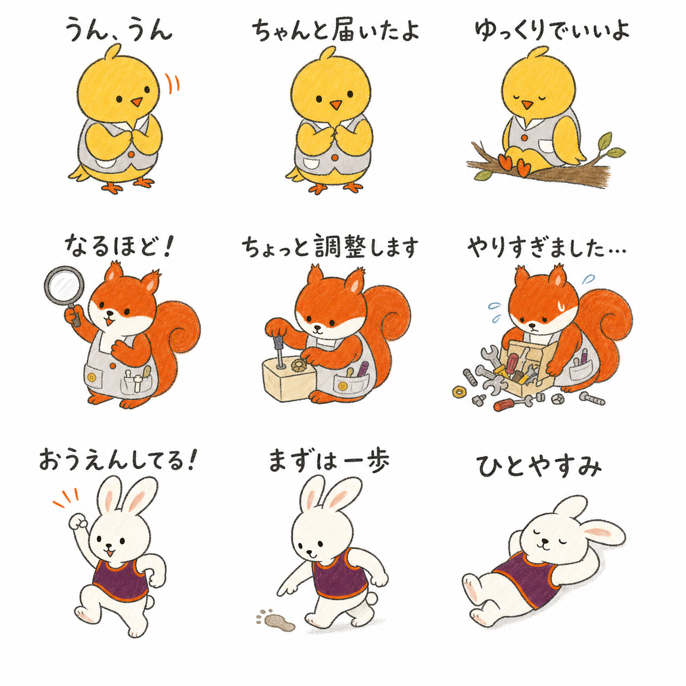

# メイン3人 LINEスタンプ企画

役割: **ことり・りす・うさぎ先生のLINEスタンプにおける役割、文言、仕草、試作範囲を管理する**

## 1. 企画の目的

専門性を説明するスタンプではなく、日常会話で使える言葉に3人の個性を乗せる。

```text
ことり先生 = 気持ちを受け止める
りす先生   = 方法を一緒に探す
うさぎ先生 = 一歩を応援する
```

全体の約7割を日常語、約3割をHugMapらしい固有表現にする。

## 2. 24個の基本セット

### ことり先生――聞く・共感する

| 文言 | 仕草・表情 | 主な使用場面 |
|---|---|---|
| うん、うん | 首を傾け、羽根を静かに重ねる | 話を聞いている |
| そうだったんだ | 眉を少し下げ、相手を見る | 共感、報告への返事 |
| きかせて | 耳を寄せるように身体を傾ける | 続きを聞きたい |
| ちゃんと届いたよ | 胸の前で羽根を包む | 気持ちを受け取った |
| どっちがいい？ | 左右の羽根で二つを示す | 予定や食事の相談 |
| ゆっくりでいいよ | 枝に座ってのんびり待つ | 返信や決断を待つ |
| ぎゅうする？ | 少し距離を残して羽根を広げる | 励ましたい |
| ありがとう♪ | 歌いながら羽根をぱたぱたさせる | 感謝 |

代表スタンプは「ちゃんと届いたよ」。愛嬌のある弱点「のんき」は「ゆっくりでいいよ」で見せる。

### りす先生――調べる・工夫する

| 文言 | 仕草・表情 | 主な使用場面 |
|---|---|---|
| なるほど！ | 虫眼鏡を持ち、目を大きくする | 内容を理解した |
| しらべてみるね | 虫眼鏡と小さなメモを持つ | 確認してから返事する |
| これかな？ | 道具箱から一つ取り出す | 提案、候補を出す |
| ためしてみよう | 袖をまくり、道具を並べる | 新しい案を試す |
| ちょっと調整します | ねじやつまみを少し動かす | 日程や内容の調整 |
| できる形をさがそう | 大きな作業を小さく分ける | 難しい相談への返事 |
| はっけん！ | 尻尾を立て、電球が光る | 気づき、朗報 |
| やりすぎました… | 道具が箱からあふれる | 失敗、謝罪 |

代表スタンプは「ちょっと調整します」。愛嬌のある弱点「いたずら好き」は「やりすぎました…」で見せる。

### うさぎ先生――応援する・一緒に動く

| 文言 | 仕草・表情 | 主な使用場面 |
|---|---|---|
| おうえんしてる！ | 頑張るポーズで耳を立てる | 仕事、試験、挑戦 |
| まずは一歩 | 小さな足跡を一つ置く | 始めるのが難しいとき |
| いっしょにやろう | 隣に並び、手を差し出す | 協力、誘い |
| やったー！ | ぴょんぴょん跳ねて拍手する | 成功を祝う |
| もういっかい？ | ボールを抱えて首を傾ける | 再挑戦、遊び |
| むりしないでね | 耳を下げ、相手の隣に座る | 体調や疲労への配慮 |
| ひとやすみ | 大の字で寝転ぶ | 休憩 |
| はりきりすぎました… | 道具を抱えすぎて息切れする | 張り切りすぎたとき |

代表スタンプは「まずは一歩」。愛嬌のある弱点「張り切り屋」は「はりきりすぎました…」で見せる。

## 3. 最初に試作する9個

| キャラクター | 試作1 | 試作2 | 試作3 |
|---|---|---|---|
| ことり先生 | うん、うん | ちゃんと届いたよ | ゆっくりでいいよ |
| りす先生 | なるほど！ | ちょっと調整します | やりすぎました… |
| うさぎ先生 | おうえんしてる！ | まずは一歩 | ひとやすみ |

この9個で次を確認する。

- 小さい表示でも3人のシルエットを見分けられるか。
- 顔より先に、羽根、尻尾、耳、全身姿勢で意味が伝わるか。
- 文言を読まなくても「受容・工夫・応援」の違いが分かるか。
- 愛嬌のある弱点が、失敗の嘲笑ではなく親しみとして見えるか。
- よく使う日常語と、HugMap固有の言葉の両方があるか。

## 4. ビジュアル原則

- 背景は白または透過とし、四角いパネル境界を描かない。
- 既存の絵本と同じ、手描きの揺れが残るクレヨン・色鉛筆調にする。
- 黒い輪郭は均一にせず、少しかすれと強弱を残す。
- キャラクターの周囲に十分な余白を取る。
- 小さな装飾より、頭、手足、羽根、尻尾、耳の大きな動きを優先する。
- 文字は太く短くし、キャラクターの顔や手を隠さない。
- 文字がなくても意味が伝わるポーズを先に設計する。
- ことりは黄色、りすは橙、うさぎは白を基本とし、服装と体格を既存設定から変えない。

## 5. 3人の使い分け

| 送りたい気持ち | キャラクター | 代表文言 |
|---|---|---|
| 気持ちを受け止める | ことり先生 | ちゃんと届いたよ |
| 解決方法を探す | りす先生 | ちょっと調整します |
| 挑戦を支える | うさぎ先生 | まずは一歩 |
| 急がせず待つ | ことり先生 | ゆっくりでいいよ |
| 確認して返事する | りす先生 | しらべてみるね |
| 休むことを勧める | うさぎ先生 | ひとやすみ |

## 6. 試作後に判断すること

- 24個を一つのセットにするか、キャラクター別に分けるか。
- 文字を手描きにするか、可読性の高い共通書体にするか。
- 実用語を増やすか、HugMap固有表現を増やすか。
- 先生だけを描くか、道具や小さな効果線を含めるか。
- 最終素材を透過PNGとして個別制作する際の余白と文字サイズ。

## 7. 9個の試作シート



ファイル: [`line-sticker-prototypes/main-three-nine-sticker-sheet-v1.png`](line-sticker-prototypes/main-three-nine-sticker-sheet-v1.png)

### 試作で確認できたこと

- ことりは羽根を身体の前へ置くと、傾聴と受容が伝わる。
- りすは虫眼鏡、調整道具、あふれた道具箱で、探偵・発明家・いたずら好きの三面を分けられる。
- うさぎは立つ、歩く、寝転ぶという全身の高低差が大きく、応援と休息の両方を表現しやすい。
- 3人とも既存の体色と服装で見分けられる。
- 白背景、境界線なしでも9個のまとまりを保てる。

### 最終素材化の前に直すこと

- 生成画像内の文字をそのまま納品に使わず、正式な文字レイヤーで組み直す。
- 「おうえんしてる！」を含め、句読点と全角記号を統一する。
- 各スタンプを一枚ずつ描き直し、透明背景へ切り出す。
- 小さい表示で読めるよう、文字の太さとキャラクターとの距離を実機確認する。
