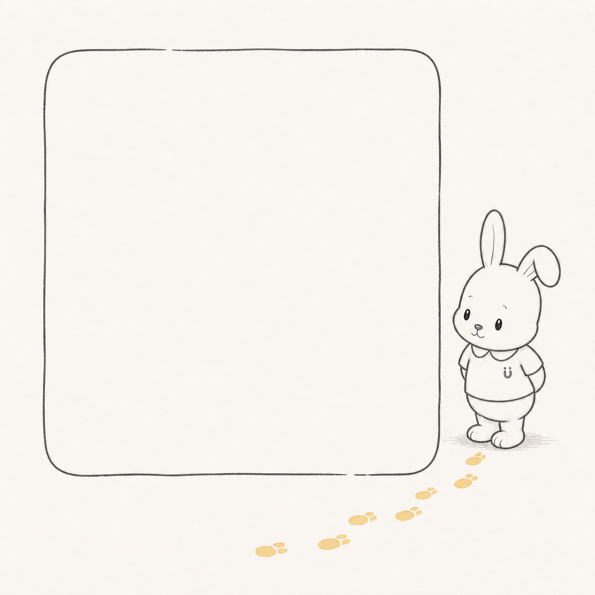
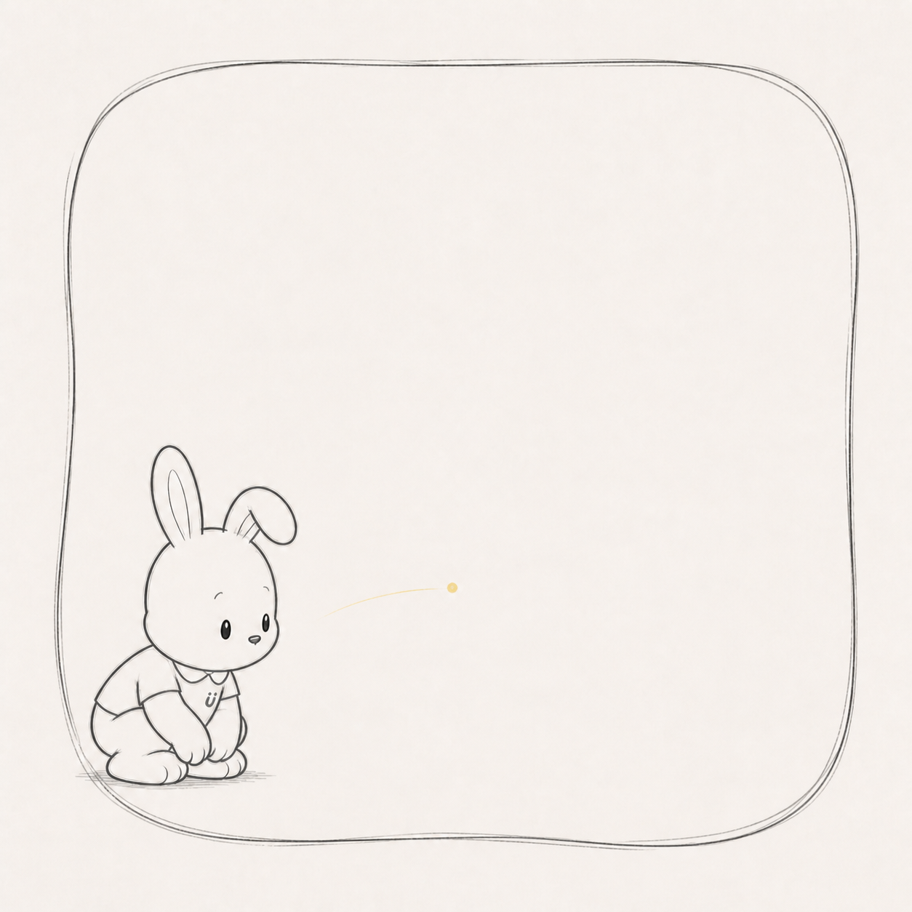
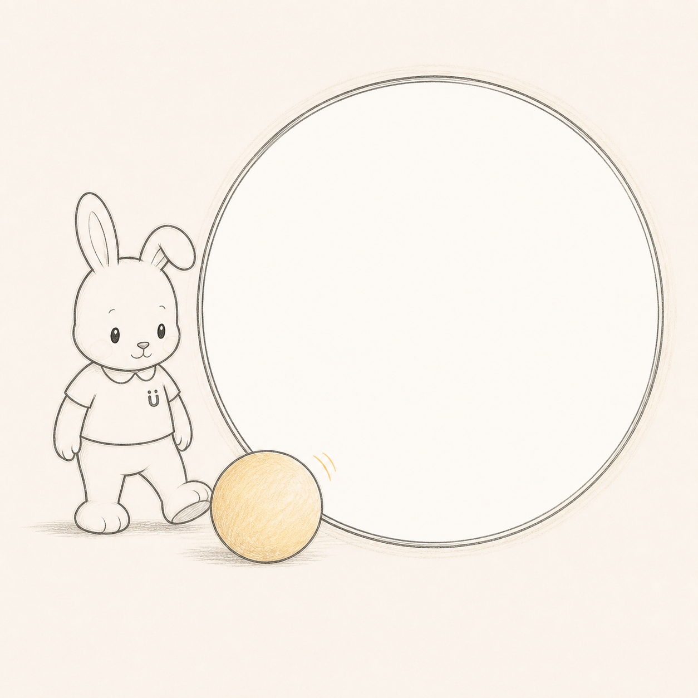
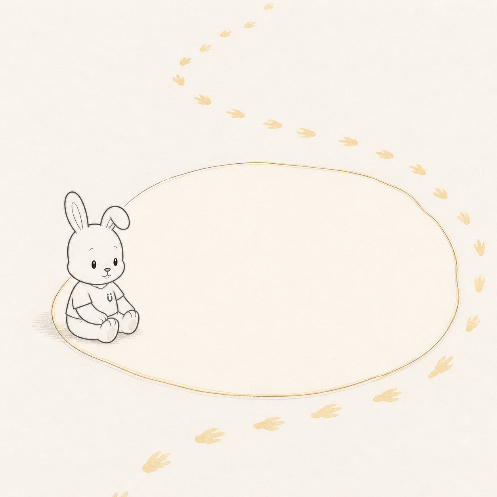
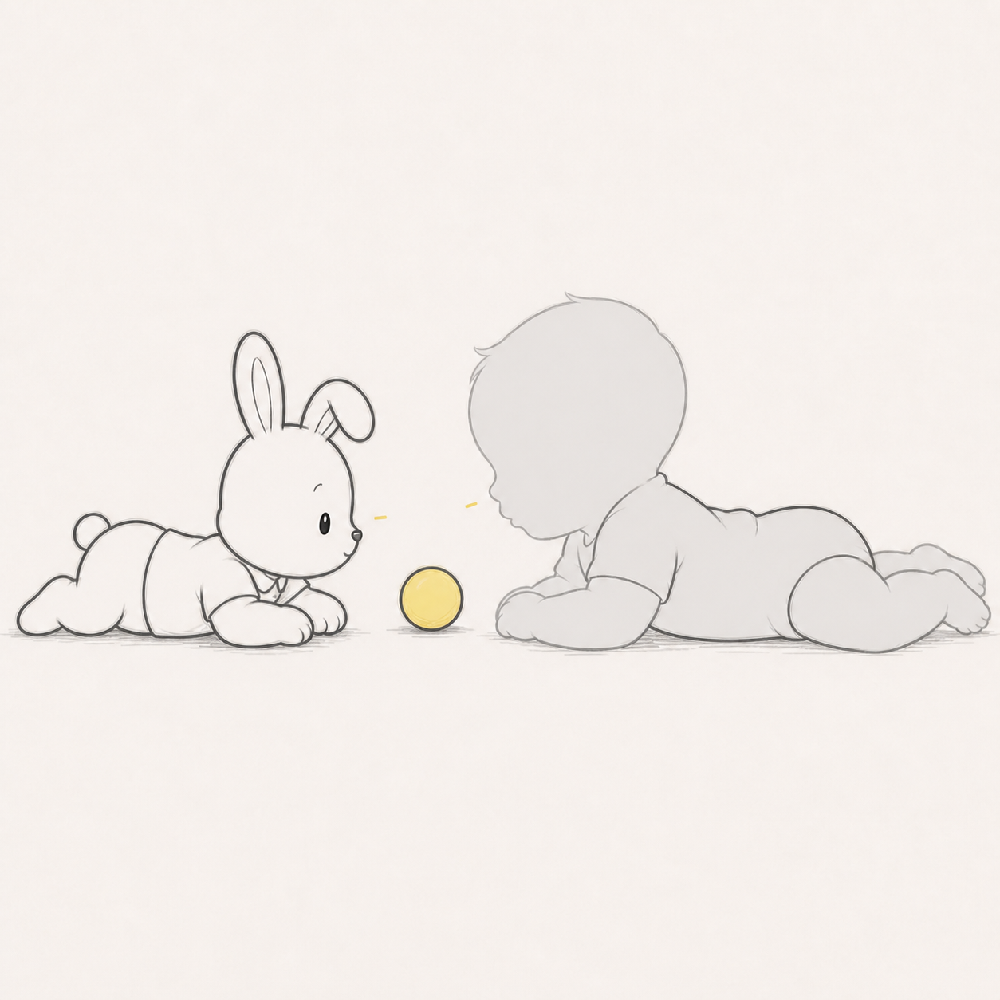
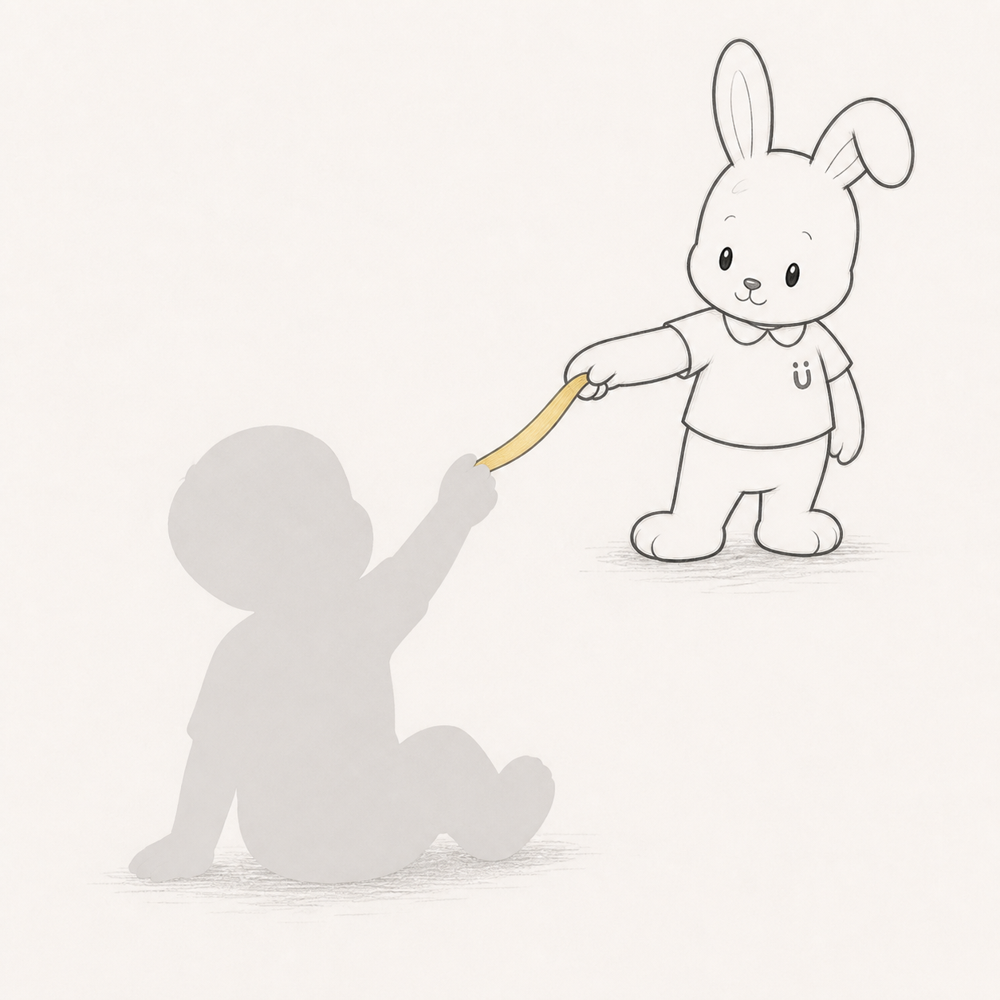
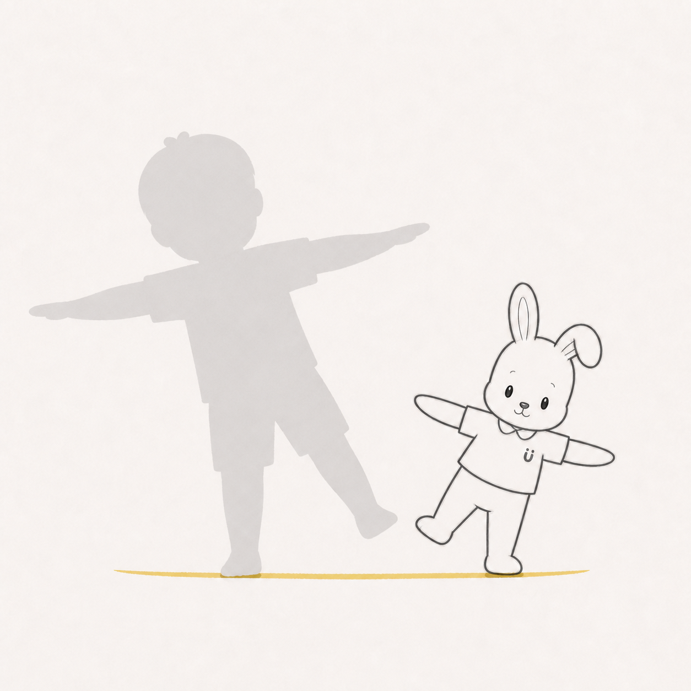
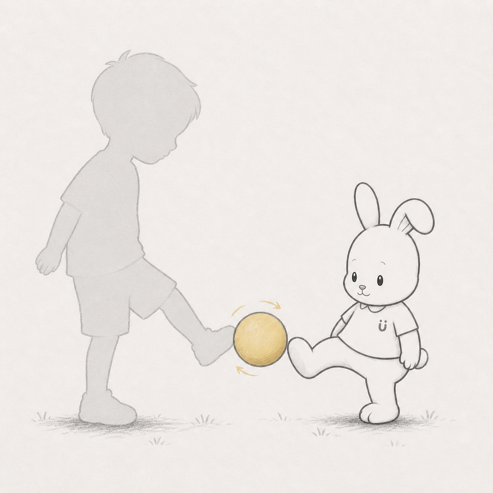

# 参加者が入って初めて成立する成長フレーム：参照と初期仮説

作成日: 2026-08-13  
対象: withu の発達記録から生成する写真・短尺動画フレーム  
初期キャラクター: ゲン（うさぎ先生）

## 1. 目的

完成済みのキャラクターイラストへ子どもの写真を飾るのではなく、子どもの身体、選択、痕跡が入ることで、キャラクターの行為と画面の意味が初めて完成するフレームを設計する。

HugMap Stories の価値観に合わせ、発達を一本道の達成、競争、正常化として扱わない。見る、触れる、休む、一部分だけ参加する、別の方法を選ぶことも、成立した参加として扱う。

## 2. 参照する参加型芸術

### Erwin Wurm — *One Minute Sculptures*

- 日用品、短い指示、観客の身体が組み合わさって一時的な彫刻が成立する。
- 観客がいない状態は「失敗した作品」ではなく、作動前のスコアである。
- 学ぶ点: 一目で試せる動詞、身体が入る明確な余白、写真に残したくなる関係。
- 参照: [MoMA, Tempo press material](https://press.moma.org/wp-content/press-archives/PRESS_RELEASE_ARCHIVE/Tempo.pdf)

### Franz Erhard Walther — *First Work Set*

- 布の形は、それ自体が完成像ではなく、持つ、着る、踏む、広げる行為のための道具である。
- 学ぶ点: フレームを装飾ではなく「行為を起動する道具」として設計する。
- 参照: [Dia Art Foundation, Franz Erhard Walther](https://diaart.org/program/past-programs/franz-erhard-walther-exhibition/page/12/year/all/location/dia-beacon-beacon-united-states)

### Lygia Clark — *Bichos*

- 観客が触れて形を変える。唯一の理想的完成形がなく、選択のたびに別の状態が成立する。
- 学ぶ点: 正解ポーズを要求せず、子どもの参加方法に応じて構図側が変わること。
- 参照: [MoMA, Lygia Clark, Poetic Shelter](https://www.moma.org/collection/works/91767)

### Yoko Ono — *Instructions for Paintings*

- 最小限の言葉を起点に、観客が現実または想像の中で作品を実現する。
- 学ぶ点: 説明を増やさず、短い詩的な一文を作品のスイッチにする。
- 参照: [MoMA, Yoko Ono’s 22 Instructions for Paintings](https://www.moma.org/magazine/articles/61)

### Rafael Lozano-Hemmer — *Pulse Room*

- 参加者固有の心拍が光へ変換され、参加が空間の状態そのものを変える。
- 学ぶ点: 写真を貼るだけでなく、子どもの行動を足跡、軌跡、光、キャラクターの反応へ翻訳する。
- 参照: [Rafael Lozano-Hemmer, Pulse Room](https://www.lozano-hemmer.com/artworks/pulse_room.php)

## 3. HugMap への翻訳原則

1. **空白に意味を持たせる**  
   写真が未挿入の状態で、誰がどこへ入り、何が完成するかを読めるようにする。

2. **キャラクターの反応を未完にする**  
   ゲン単体で祝ったり完結したりせず、子どもの姿が入って初めて「合わせる」「一緒に動く」が成立する。

3. **参加方法を複数残す**  
   歩く、立つ、座る、見る、触る、休むを上下関係にしない。同じフレームが複数の参加方法を受け入れる。

4. **子どもを中央、キャラクターを斜め横か少し後ろへ置く**  
   ゲンが先生として先導し続けず、子どもの速度へ合わせたことが位置関係で分かるようにする。

5. **ラベルより観察できる事実を見せる**  
   「歩けた」だけでなく、「足を出した」「ボールへ触れた」「ここで休んだ」のような一瞬を扱う。

## 4. ゲンのキャラクター核

- 人物像: 伴走型の応援者
- 最初に見るもの: 姿勢、足元、バランス、疲れ方
- 基本の動き: 一緒に動く
- 演技: 張り切る → 気づく → 相手に合わせる
- 役割の動詞: 誘う／気づく／合わせる／小さく祝う
- 避ける表現: 成功するまで励まし続ける、大声で祝う、子どもより前でゴールへ導く

## 5. development 環境の対象例

`category_stage` と `development_item` のうち、初期ラフに関連する代表例。

- あおむけ: 頭を正中で保持する、手で膝や足を触る
- うつ伏せ: 前腕で支える、反対側の手をおもちゃへ伸ばす、ずり這い
- 座る: 支えて座る、支えなしで座る、斜め後ろへ手を伸ばす
- 立つ: つかまり立ち、一人で立つ、しゃがむ、しゃがんだ姿勢を保つ
- 歩く: つたい歩き、手をつないで歩く、一人で歩く
- 走る・ジャンプ: ボールを蹴る、ジャンプ、階段、屋外を走る

年齢範囲はテンプレートの表示条件には使えるが、共有画像上で順位、期限、標準到達時期として強調しない。

## 6. 初期フレーム4案

### A. 歩幅をつなぐ

- 作動前: ゲンの黄色い足跡が途中で止まり、その先に写真用の空白がある。
- 写真挿入後: 子どもの足元から、その子の幅と向きの足跡が続く。
- 成立する動詞: 合わせる。
- 主な対象: 立つ、歩く、つたい歩き、手をつないで歩く。

### B. 同じ高さで見る

- 作動前: ゲンが低くしゃがみ、空白の一点を見ている。
- 写真挿入後: 座る、うつ伏せ、遊具を見る子どもと視線の高さがつながる。
- 成立する動詞: 気づく、待つ。
- 主な対象: あおむけ、うつ伏せ、座る、見るだけの参加。

### C. 触れるところから

- 作動前: ゲンはボールを蹴らず、片足をボールの横へ添え、反対側を空けている。
- 写真挿入後: 子どもの手、足、視線のいずれかがボールへ関わることで円環が完成する。
- 成立する動詞: 誘う、合わせる。
- 主な対象: 手を伸ばす、姿勢保持、ボールへ触る、蹴る。

### D. 休憩も道の一部

- 作動前: 足跡の途中に小さな休憩島があり、ゲンが腰を下ろして隣を空けている。
- 写真挿入後: 座る、横になる、休む子どもの姿が道の一場面になる。
- 成立する動詞: 気づく、速度を合わせる。
- 主な対象: 疲れ方、持続力、部分参加、外遊び、歩行・走行の途中。

## 7. STEP 5 制作制約

- STEP 4 のゲンの頭幅、頭高、胴長、腕長、耳、衣服、Uマークを維持する。
- 頭、胴体、手足をポーズごとに拡大縮小しない。
- 回転、傾き、関節の曲げで演技する。
- 手は指を描き分けない柔らかな塊にする。
- 顔を隠しても動詞が読める。
- 目、眉、口の変更は最小限にする。
- 均一なベクター線ではなく、わずかな揺れと欠けを持つ手描き線にする。
- ラフ段階では白黒を基本とし、意味を担う黄色い足跡・ボールだけを限定的に使う。

## 8. 評価方法

各ラフについて、次を確認する。

- 写真なしでも「どこが未完か」が分かるか。
- 写真を入れると、ゲンではなく子どもが主役になるか。
- 立つ・歩く・蹴る以外の参加方法でも成立するか。
- 顔を隠しても、ゲンが相手へ合わせたことが読めるか。
- 「できた証明」ではなく「見つけた一場面」になっているか。

## 9. 2026-08-13 初期ラフ

画像生成による構図検証用ラフ。キャラクター正本や実装用フレーム素材ではない。写真領域は白い仮置きであり、実装時には透過マスクまたは写真クリップ領域として再制作する。

### A. 歩幅をつなぐ

- 良い点: 写真領域が主、ゲンが従になり、足跡が画面外から写真へ関係を運ぶ。
- 次の検証: ゲン自身の足跡で完結して見えるため、写真領域の内部で足跡を意図的に途切れさせる。ゲンの歩幅が小さくなった演技も強める。

### B. 同じ高さで見る

- 良い点: しゃがむことで「相手へ合わせる」が顔なしでも読める。うつ伏せ、座位、見るだけの写真にも適用しやすい。
- 次の検証: 視線の黄色い点が目的物に見えすぎないよう、写真内の実物または子どもの視線へ接続したときだけ現れる仕様にする。

### C. 触れるところから

- 良い点: ボールがイラスト領域と写真領域をまたぐ接点になり、子どもの手・足・視線のどれでも参加できる。
- 次の検証: 円形写真フレームに見えすぎる。子どもの接触位置に応じてボールの場所やゲンの足の向きを変える可変構図へ進める。

### D. 休憩も道の一部

- 良い点: 座るゲンと空席の関係が明快で、休む写真を肯定的な一場面として扱える。
- 次の検証: 足跡がゴールへ進む経路に見えないよう、始点と終点を弱める。休憩島と写真領域を同一にせず、写真が入ることで島が初めて成立する構造にする。

## 10. 初期判断

次の反復では **B「同じ高さで見る」** と **C「触れるところから」** を優先する。

- B はゲン固有の「張り切る → 気づく → 相手へ合わせる」を身体演技だけで表しやすい。
- C は、子どもの参加方法を一つに固定せず、写真とキャラクター世界の境界を道具でつなげられる。
- A と D は足跡が進歩・順路の記号に見えやすいため、一本道にしないための追加検証が必要。

## 11. 2026-08-13 レビュー訂正：空白ではなく身体スコアを設計する

初期ラフの問題は、写真領域とゲンを隣に配置しただけで、子どもの身体とゲンの間に会話がなかったことにある。写真の内容やポーズを問わず成立するため、「子どもが入って初めて成立する作品」になっていない。

次版では、空の写真枠から設計しない。先に次の3点を固定する。

1. **子どもの具体的な身体動詞**: うつ伏せで頭を上げる、座って手を伸ばす、片足へ重心を移す、足でボールを送る。
2. **ゲンの応答動詞**: 同じ高さになる、届く位置へ返す、同じ傾きをつくる、受け取る。
3. **二者の間に生まれる一つの形**: 視線の輪、対角線、左右で支える弧、ボールの往復。

フレームは、この3点がそろった「身体の会話」の外周として後から設計する。

### v2 の身体スコア

| 案 | 子どもが必要なポーズ | ゲンの返答 | 二人で初めて生まれる形 | 対象例 |
|---|---|---|---|---|
| E. ひくいところで、こんにちは | うつ伏せで前腕支持し、頭を上げる | ゲンも腹ばいになり、反対側から見る | 二人の視線と中央のボールによる低い三角形 | うつ伏せ、前腕支持、頭部挙上 |
| F. ここまで、とどいた | 座位で斜め上へ片手を伸ばす | ゲンが反対側から短いリボンを差し出す | 子どもの腕＋リボン＋ゲンの腕による一本の対角線 | 座位保持、斜めへ手を伸ばす |
| G. おなじ傾き | 片足へ重心を移し、両腕を横へ広げる | ゲンが反対向きに同じ傾きを返す | 左右対称の天秤／一つの山形 | 立位、バランス、片足荷重 |
| H. そっちへ、どうぞ | 片足を上げてボールへ触れる／蹴る | ゲンが反対側で片足を添えて受ける | 二つの足と中央のボールによる往復 | ボールへ触る、蹴る、片足立位 |

各案は、指定ポーズ以外の写真を入れた場合に会話が崩れることを意図する。これは排除ではなく、記録済みの写真から姿勢を判定し、その写真に合う別フレームを提案するための分類である。

## 12. v2 身体会話ラフ

子どもの灰色部分は写真切り抜きの仮置き。完成版では、実際の写真から人物を切り抜いて同じ位置へ配置する。

### E. ひくいところで、こんにちは

- 子どもの必要ポーズ: うつ伏せ、前腕支持、頭を上げる。
- 成立点: ゲンも腹ばいになり、二人の低い視線が中央のボールで出会う。
- 評価: 身体の高さが会話そのものになっている。指定ポーズでないと成立しないため、v1から明確に改善。

### F. ここまで、とどいた

- 子どもの必要ポーズ: 座位を保ち、片手を斜め上へ伸ばす。
- 成立点: 子どもの腕、黄色いリボン、ゲンの腕が一本の対角線になる。
- 評価: ポーズ依存性は高い。一方でゲンが子どもを引っ張っているようにも読めるため、次版ではリボンを張らず、触れた瞬間の柔らかな輪へ変更する。

### G. おなじ傾き

- 子どもの必要ポーズ: 片足荷重、両腕を横へ広げ、身体を傾ける。
- 成立点: ゲンが反対向きの傾きを返し、二人の身体で天秤形ができる。
- 評価: 子どもの姿勢がそのまま構図になる。ただし単なるまねっこに見えないよう、左右の手の間へ小さな共通対象を置く余地がある。

### H. そっちへ、どうぞ

- 子どもの必要ポーズ: 片足を上げ、足先をボールへ向ける。
- 成立点: 子どもの足、ボール、ゲンの足が浅いV字になり、送る／受け取るの往復が生まれる。
- 評価: 写真とイラストが同じ物体へ直接作用しており、会話が最も明快。見るだけ、手で触る場合には別ポーズ版を用意する。

## 13. v2 初期判断

- 最有力: **E「ひくいところで、こんにちは」**、**H「そっちへ、どうぞ」**
- 継続: **G「おなじ傾き」**
- 要修正: **F「ここまで、とどいた」**。引っ張る支援に見えない関係へ変える。

以後のテンプレート企画では、「空いている写真枠」だけの案を不採用とする。必ず `子どもの身体動詞 → ゲンの応答動詞 → 二人で生まれる形` を先に記述してから描画する。
