# 参加者が入って初めて成立する成長フレーム：参照と初期仮説

作成日: 2026-08-13  
対象: withu の発達記録から生成する写真・短尺動画フレーム  
初期キャラクター: ゲン（うさぎ先生）

## 1. 目的

完成済みのキャラクターイラストへ子どもの写真を飾るのではなく、子どもの身体、選択、痕跡が入ることで、キャラクターの行為と画面の意味が初めて完成するフレームを設計する。

HugMap Stories の価値観に合わせ、発達を一本道の達成、競争、正常化として扱わない。見る、触れる、休む、一部分だけ参加する、別の方法を選ぶことも、成立した参加として扱う。

## 2. 参照する参加型芸術

### Erwin Wurm — *One Minute Sculptures*

- 日用品、短い指示、観客の身体が組み合わさって一時的な彫刻が成立する。
- 観客がいない状態は「失敗した作品」ではなく、作動前のスコアである。
- 学ぶ点: 一目で試せる動詞、身体が入る明確な余白、写真に残したくなる関係。
- 参照: [MoMA, Tempo press material](https://press.moma.org/wp-content/press-archives/PRESS_RELEASE_ARCHIVE/Tempo.pdf)

### Franz Erhard Walther — *First Work Set*

- 布の形は、それ自体が完成像ではなく、持つ、着る、踏む、広げる行為のための道具である。
- 学ぶ点: フレームを装飾ではなく「行為を起動する道具」として設計する。
- 参照: [Dia Art Foundation, Franz Erhard Walther](https://diaart.org/program/past-programs/franz-erhard-walther-exhibition/page/12/year/all/location/dia-beacon-beacon-united-states)

### Lygia Clark — *Bichos*

- 観客が触れて形を変える。唯一の理想的完成形がなく、選択のたびに別の状態が成立する。
- 学ぶ点: 正解ポーズを要求せず、子どもの参加方法に応じて構図側が変わること。
- 参照: [MoMA, Lygia Clark, Poetic Shelter](https://www.moma.org/collection/works/91767)

### Yoko Ono — *Instructions for Paintings*

- 最小限の言葉を起点に、観客が現実または想像の中で作品を実現する。
- 学ぶ点: 説明を増やさず、短い詩的な一文を作品のスイッチにする。
- 参照: [MoMA, Yoko Ono’s 22 Instructions for Paintings](https://www.moma.org/magazine/articles/61)

### Rafael Lozano-Hemmer — *Pulse Room*

- 参加者固有の心拍が光へ変換され、参加が空間の状態そのものを変える。
- 学ぶ点: 写真を貼るだけでなく、子どもの行動を足跡、軌跡、光、キャラクターの反応へ翻訳する。
- 参照: [Rafael Lozano-Hemmer, Pulse Room](https://www.lozano-hemmer.com/artworks/pulse_room.php)

## 3. HugMap への翻訳原則

1. **空白に意味を持たせる**  
   写真が未挿入の状態で、誰がどこへ入り、何が完成するかを読めるようにする。

2. **キャラクターの反応を未完にする**  
   ゲン単体で祝ったり完結したりせず、子どもの姿が入って初めて「合わせる」「一緒に動く」が成立する。

3. **参加方法を複数残す**  
   歩く、立つ、座る、見る、触る、休むを上下関係にしない。同じフレームが複数の参加方法を受け入れる。

4. **子どもを中央、キャラクターを斜め横か少し後ろへ置く**  
   ゲンが先生として先導し続けず、子どもの速度へ合わせたことが位置関係で分かるようにする。

5. **ラベルより観察できる事実を見せる**  
   「歩けた」だけでなく、「足を出した」「ボールへ触れた」「ここで休んだ」のような一瞬を扱う。

## 4. ゲンのキャラクター核

- 人物像: 伴走型の応援者
- 最初に見るもの: 姿勢、足元、バランス、疲れ方
- 基本の動き: 一緒に動く
- 演技: 張り切る → 気づく → 相手に合わせる
- 役割の動詞: 誘う／気づく／合わせる／小さく祝う
- 避ける表現: 成功するまで励まし続ける、大声で祝う、子どもより前でゴールへ導く

## 5. development 環境の対象例

`category_stage` と `development_item` のうち、フレームに関連する代表例。

- あおむけ: 頭を正中で保持する、手で膝や足を触る
- うつ伏せ: 前腕で支える、反対側の手をおもちゃへ伸ばす、ずり這い
- 座る: 支えて座る、支えなしで座る、斜め後ろへ手を伸ばす
- 立つ: つかまり立ち、一人で立つ、しゃがむ、しゃがんだ姿勢を保つ
- 歩く: つたい歩き、手をつないで歩く、一人で歩く
- 走る・ジャンプ: ボールを蹴る、ジャンプ、階段、屋外を走る

年齢範囲はテンプレートの表示条件には使えるが、共有画像上で順位、期限、標準到達時期として強調しない。

## 6. STEP 5 制作制約

- STEP 4 のゲンの頭幅、頭高、胴長、腕長、耳、衣服、Uマークを維持する。
- 頭、胴体、手足をポーズごとに拡大縮小しない。
- 回転、傾き、関節の曲げで演技する。
- 動物の腕と脚を一本線の棒へ変形しない。ゲンは「走る子どもの、そのあとを」「そっちへ、どうぞ」、ルークは「線のつづきは、こっち」「つぎのページは、その手から」を造形基準とし、袖や胴体から自然につながる短く柔らかな先細りの形を保つ。ミモの鳥脚だけは正本どおりの細い鳥脚とする。
- 手は人間の指を描き分けず、小さな丸いミトン形にする。足はポーズに合わせて短く畳めるコンパクトな丸い形とし、人体の足指、爪、筋肉、関節線を描かない。
- 衣服をポーズの都合で消さない。正面・斜め前では本人から見て右上の胸に、胸が見えない背面では上背部に、笑顔の With U マークを必ず残す。
- 腕や道具でUマークが一時的に隠れる場合も、衣服上の位置は維持する。見せるために身体へ別の記号を増やさない。
- 顔を隠しても動詞が読める。
- 目、眉、口の変更は最小限にする。
- 均一なベクター線ではなく、わずかな揺れと欠けを持つ手描き線にする。
- ラフ段階では白黒を基本とし、意味を担う黄色い足跡・ボールだけを限定的に使う。

### 成長フレーム全体の造形監査（2026-08-14）

36枚を一覧で確認し、以下を全画像の採用条件とした。

- `PASS`: 衣服、短く先細りの腕と脚、指なしの丸い手先、コンパクトな足先、胸または背中のUマークが確認できる。
- `OCCLUDED`: 姿勢や腕でマークが隠れるが、衣服と本来の位置が保たれている。
- `FIX`: 衣服またはUマークが消えた、手足が一本線の棒、人間の指・足、過度に大きなぬいぐるみ状へ変形した。

今回、寝返りと仰向けの模倣カードは `FIX` と判定し、ゲンの衣服と右胸Uを復元した。背面構図の「まって、ゲン」「走る子どもの、そのあとを」「こっち、いっしょに」も、上背部Uが見える形へ揃えた。画像編集で子どもの写真マットや人数が変わった案は、Uが正しくても不採用とする。新規制作では毎回、同じキャラクターの採用済み作例を造形参照として入力する。

ミモ7枚とルーク5枚も同じ条件で確認した。ミモは「ひとくち、どうぞ」で消えていたシャツと右胸Uを復元した。ほかの6枚はUが見えるか、布・羽で本来の胸位置が自然に隠れている。ミモの細い鳥脚は正本固有の形として `PASS` とする。既存画像の一括改修は別工程とし、新規・修正画像では採用済み作例と同じ手足の量感を保つ。

直近の新規10枚も同じ基準で再監査した。滑り台、ブランコ、シャボン玉、階段降り、シール貼りは `PASS`。ボール転がし、砂遊び、水遊び、型はめ、粘土遊びは、手先が五指や大きな掌に見えたため `FIX` とし、採用済み作例を造形参照にして、短い先細りの腕と指なしの丸いミトン形へ修正した。子ども、写真マット、遊具、玩具が変わった案は採用しない。

## 7. 評価方法

各ラフについて、次を確認する。

- 写真なしでも「どこが未完か」が分かるか。
- 写真を入れると、ゲンではなく子どもが主役になるか。
- 立つ・歩く・蹴る以外の参加方法でも成立するか。
- 顔を隠しても、ゲンが相手へ合わせたことが読めるか。
- 「できた証明」ではなく「見つけた一場面」になっているか。

## 8. 空白ではなく身体スコアを設計する

空の写真枠から設計せず、先に次の3点を固定する。

1. **子どもの具体的な身体動詞**: うつ伏せで頭を上げる、座って手を伸ばす、片足へ重心を移す、足でボールを送る。
2. **ゲンの応答動詞**: 同じ高さになる、届く位置へ返す、同じ傾きをつくる、受け取る。
3. **二者の間に生まれる一つの形**: 視線の輪、対角線、左右で支える弧、ボールの往復。

フレームは、この3点がそろった「身体の会話」の外周として後から設計する。

### ゲンの身体スコア

| 案 | 子どもが必要なポーズ | ゲンの返答 | 二人で初めて生まれる形 | 対象例 |
|---|---|---|---|---|
| E. ひくいところで、こんにちは | うつ伏せで前腕支持し、頭を上げる | ゲンも腹ばいになり、反対側から見る | 二人の視線と中央のボールによる低い三角形 | うつ伏せ、前腕支持、頭部挙上 |
| F. ここまで、とどいた | 座位で斜め上へ片手を伸ばす | ゲンが反対側から短いリボンを差し出す | 子どもの腕＋リボン＋ゲンの腕による一本の対角線 | 座位保持、斜めへ手を伸ばす |
| G. おなじ傾き | 片足へ重心を移し、両腕を横へ広げる | ゲンが反対向きに同じ傾きを返す | 左右対称の天秤／一つの山形 | 立位、バランス、片足荷重 |
| H. そっちへ、どうぞ | 片足を上げてボールへ触れる／蹴る | ゲンが反対側で片足を添えて受ける | 二つの足と中央のボールによる往復 | ボールへ触る、蹴る、片足立位 |

各案は、指定ポーズ以外の写真を入れた場合に会話が崩れることを意図する。これは排除ではなく、記録済みの写真から姿勢を判定し、その写真に合う別フレームを提案するための分類である。

## 9. ゲン身体会話フレーム

子どもの灰色部分は写真切り抜きの仮置き。完成版では、実際の写真から人物を切り抜いて同じ位置へ配置する。

### E. ひくいところで、こんにちは

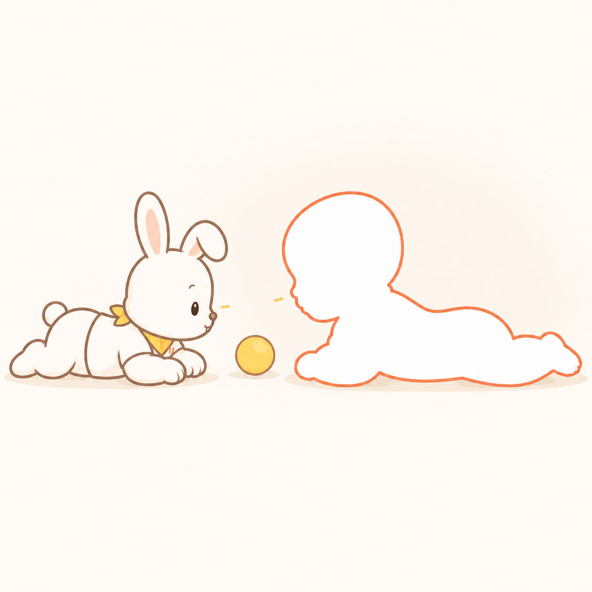

- 子どもの必要ポーズ: うつ伏せ、前腕支持、頭を上げる。
- 成立点: ゲンも腹ばいになり、二人の低い視線が中央のボールで出会う。
- 評価: 身体の高さが会話そのものになっており、指定ポーズでないと成立しない。

### F. ここまで、とどいた

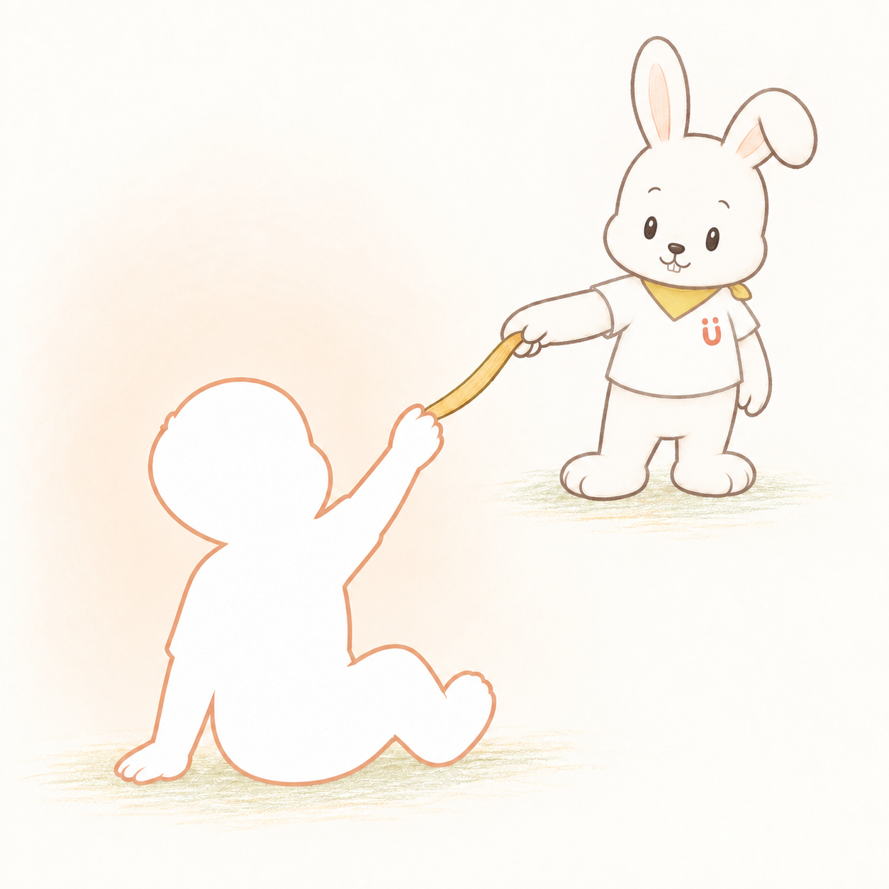

- 子どもの必要ポーズ: 座位を保ち、片手を斜め上へ伸ばす。
- 成立点: 子どもの腕、黄色いリボン、ゲンの腕が一本の対角線になる。
- 評価: ポーズ依存性は高い。一方でゲンが子どもを引っ張っているようにも読めるため、次版ではリボンを張らず、触れた瞬間の柔らかな輪へ変更する。

### G. おなじ傾き

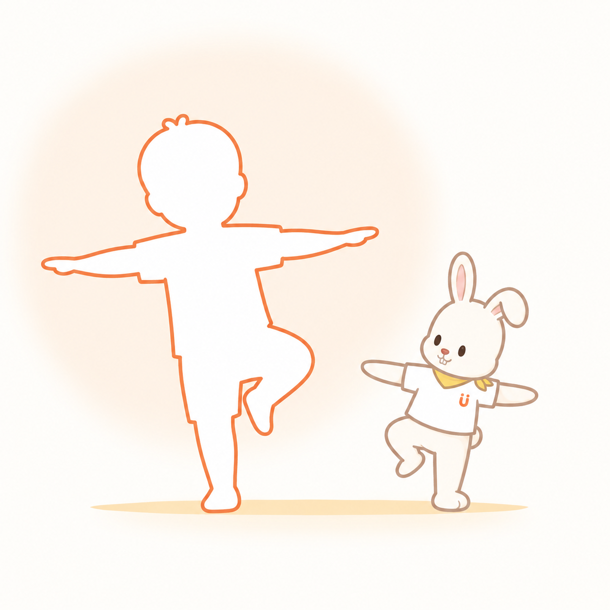

- 子どもの必要ポーズ: 片足荷重、両腕を横へ広げ、身体を傾ける。
- 成立点: ゲンが反対向きの傾きを返し、二人の身体で天秤形ができる。
- 評価: 子どもの姿勢がそのまま構図になる。ただし単なるまねっこに見えないよう、左右の手の間へ小さな共通対象を置く余地がある。

### H. そっちへ、どうぞ

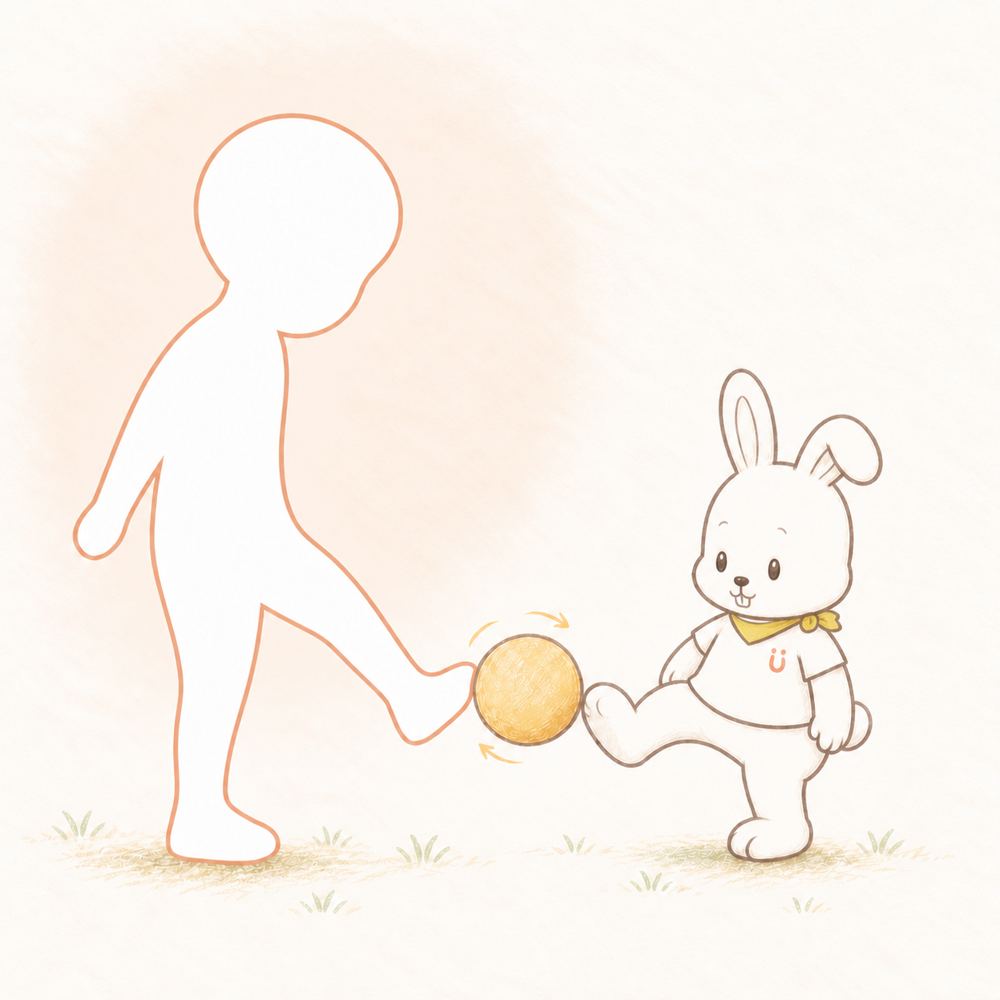

- 子どもの必要ポーズ: 片足を上げ、足先をボールへ向ける。
- 成立点: 子どもの足、ボール、ゲンの足が浅いV字になり、送る／受け取るの往復が生まれる。
- 評価: 写真とイラストが同じ物体へ直接作用しており、会話が最も明快。見るだけ、手で触る場合には別ポーズ版を用意する。

## 10. ゲン初期判断

- 最有力: **E「ひくいところで、こんにちは」**、**H「そっちへ、どうぞ」**
- 継続: **G「おなじ傾き」**
- 要修正: **F「ここまで、とどいた」**。引っ張る支援に見えない関係へ変える。

以後のテンプレート企画では、「空いている写真枠」だけの案を不採用とする。必ず `子どもの身体動詞 → ゲンの応答動詞 → 二人で生まれる形` を先に記述してから描画する。

## 11. ミモ（ことり先生）の身体会話

ミモは、子どもの表現を完成させたり言葉へ矯正したりしない。すでに出ている視線、声、仕草、間を受け取り、同じ形または小さな返事として返す。

| 案 | 子どもが必要なポーズ | ミモの返答 | 二人で初めて生まれる形 | 対象例 |
|---|---|---|---|---|
| M1. みつけたものを、いっしょに | 腕を伸ばして何かを指差し、顔も同じ方向へ向ける | ミモが反対側から指先の方向を見る | 指先、対象、二人の視線による三角形 | 指差し、共同注意、意図理解 |
| M2. その手に、おへんじ | 手を上げて振る／掌を外へ見せる | ミモが片羽を同じ高さへ上げる | 手と羽の間を往復するオレンジの弧 | ジェスチャー、バイバイ、模倣 |
| M3. みて、を受け取る | 好きな物を両手または片手で相手へ差し出す | ミモが羽を閉じて少し身を寄せ、物を見る | 子どもの腕、物、ミモの視線による小さな輪 | 好きな物を見せる、いっしょに見る |
| M4. 声のピンポン | 横顔で口を開き、声を出す | ミモも小さく嘴を開き、声量を合わせる | 二つの口の間を交互に進むオレンジの点 | クーイング、喃語、声を出して笑う |

ミモでは、吹き出しを言葉の象徴として固定しない。オレンジの点は、声だけでなく視線、手、沈黙の往復にも使う。

## 12. ルーク（りす先生）の身体会話

ルークは、正しい道具を渡して終わらない。子どもの手がすでにしている操作を観察し、その操作が続く位置へ一つだけ部品、支え、続き方を置く。

| 案 | 子どもが必要なポーズ | ルークの返答 | 二人で初めて生まれる形 | 対象例 |
|---|---|---|---|---|
| L1. その小さなもの、発見 | 親指と人差し指で小さな物をつまむ | ルークが反対側から虫眼鏡を合わせる | 子どもの指先が虫眼鏡の中心になる | 握る・つまむ、目と手の協調 |
| L2. さいごの一個は、いっしょに | 両手または片手で積み木を置こうとする | ルークが反対側から屋根部品を添える | 子どもの積み木と紫の屋根で一軒の形になる | 積み木、配置、構成遊び |
| L3. 線のつづきは、こっち | クレヨンを持ち、紙へ線を引く | ルークが線の先で別の短い線を返す | 実写の線と紫の線が一つの道／輪になる | 描く・書く、道具操作 |
| L4. ひらく手、受け取る箱 | 物を持った手を開き、容器へ離す | ルークが容器の反対側を押さえる | 手、落ちる物、容器による縦の連続 | 運ぶ・離す、容器へ入れる |

ルークの道具は子どもの動作を代行しない。子どもの写真がなければ、虫眼鏡の中心、屋根の下、線の始点、容器の上が意図的に欠ける構造にする。

## 13. ミモ初期フレーム

### M1. みつけたものを、いっしょに

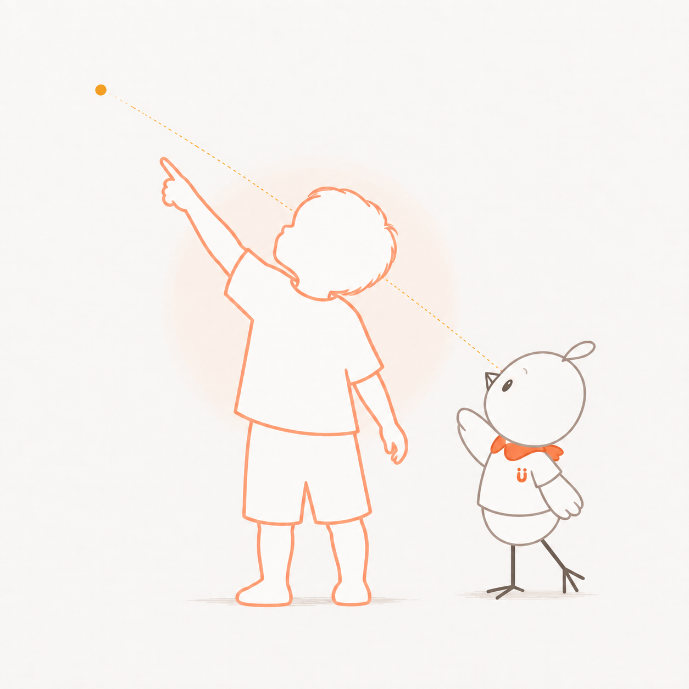

- 指差す子どもの腕が画面の主線になり、ミモは指ではなく子どもが示した先を見る。
- 子どもの指先、オレンジの点、二人の視線で三角形が成立する。
- 評価: ミモの「気づく」が最も明快。共同注意の代表案として有力。

### M3. みて、を受け取る

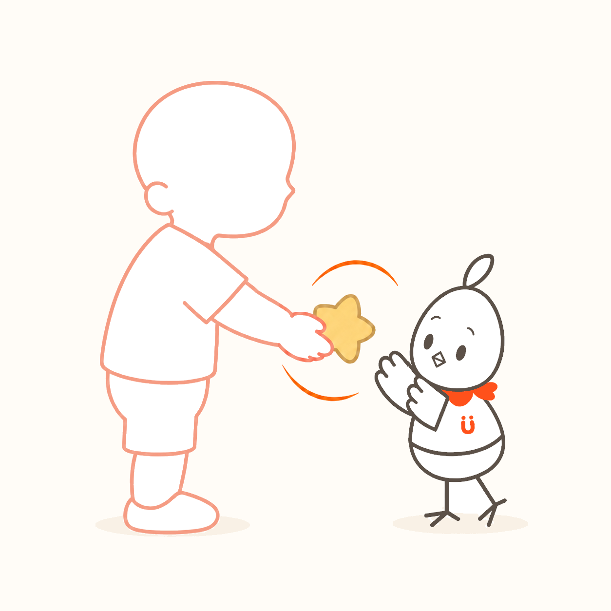

- 子どもが物を差し出すポーズと、取らずに見るミモの姿勢が会話になる。
- 評価: HugMapの「好きから始める」と相性がよい。ただし物自体を固定デザインにせず、実際の写真内の対象を活かす必要がある。

### M4. 声のピンポン

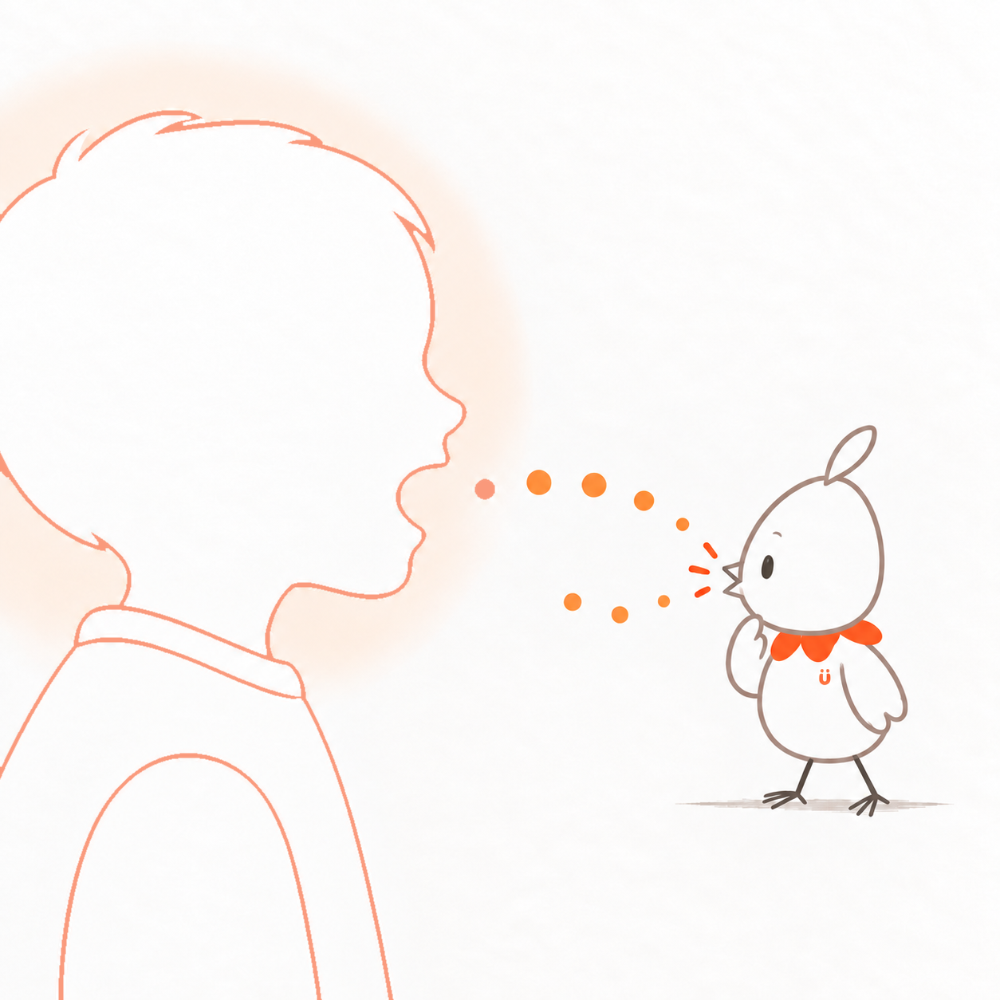

- 子どもの開いた口がオレンジ点の起点となり、ミモの嘴から小さな点が戻る。
- 評価: 一方向の「発語」ではなくやりとりとして見える。動画化したときに最も強い。

### ミモ初期判断

- 静止画の最有力: **M1 指差しと共同注意**
- 動画の最有力: **M4 声のピンポン**
- 写真内容への適応性: **M3 みて、を受け取る**

## 14. ルーク初期フレーム

### L1. その小さなもの、発見

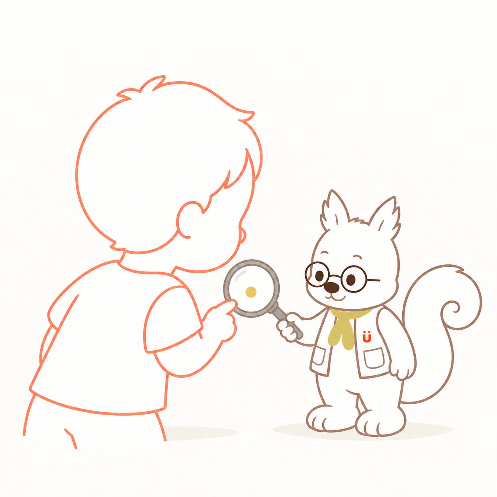

- 子どものつまんだ物が虫眼鏡の中心になり、子どもの指とルークの道具が一つの観察装置になる。
- 評価: ルークらしさは強い。ただし「評価・検査」に見えないよう、虫眼鏡のサイズと表情をさらに遊び寄りにする。

### L2. さいごの一個は、いっしょに

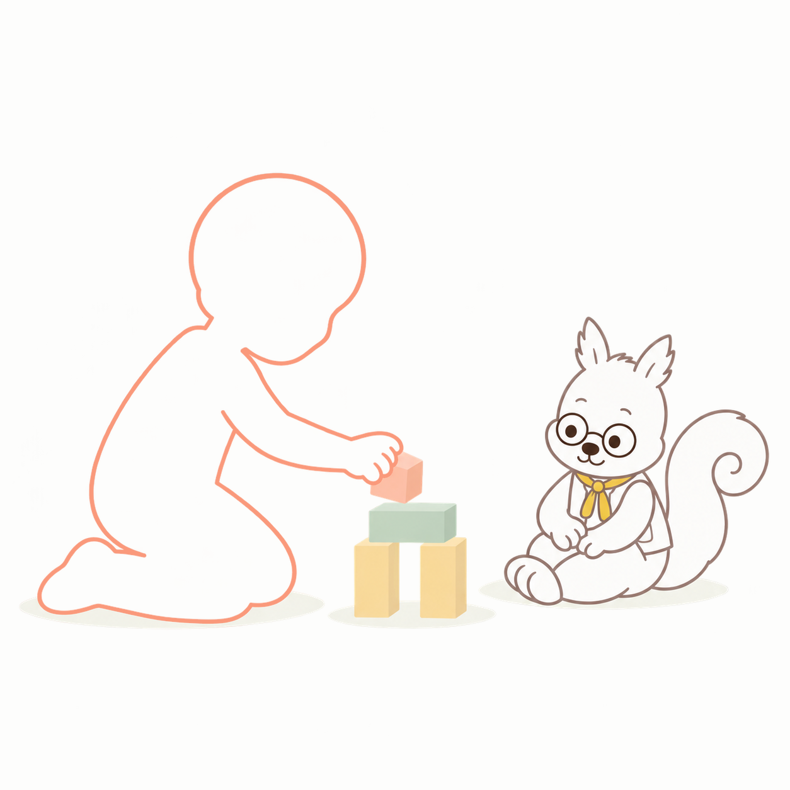

- 子どもの置くブロックとルークが待っている屋根が、同じ構造物に関わる。
- 評価: 共同制作は伝わるが、ルークが完成形を先に決めている。屋根ではなく「二つから子どもが選ぶ部品」にするとキャラクター核へ近づく。

### L3. 線のつづきは、こっち

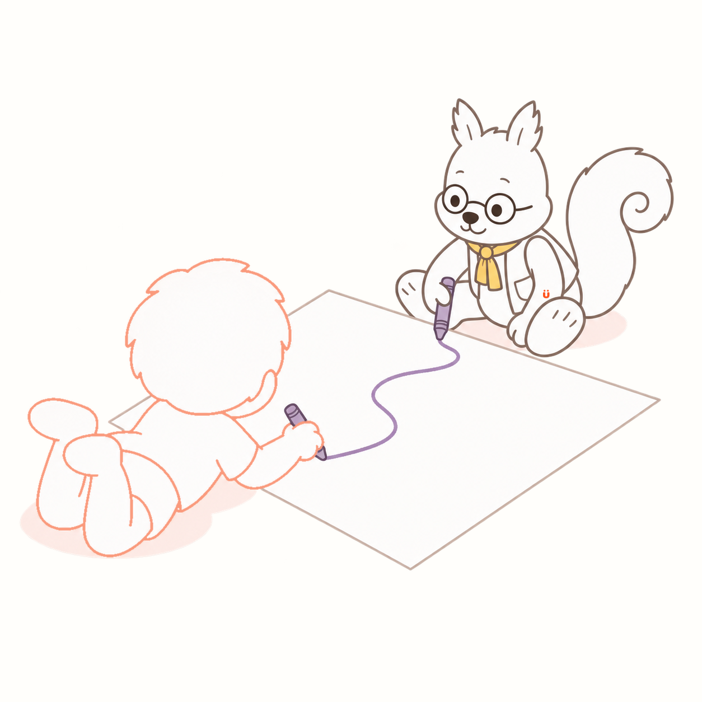

- 子どものクレヨン線をルークが修正せず、その先から短く返して一つの輪を作る。
- 評価: 実写とイラストの境界が消え、子どもの痕跡が作品の中心になる。ルーク案の最有力。

### ルーク初期判断

- 最有力: **L3 線のつづきは、こっち**
- 継続: **L1 その小さなもの、発見**
- 要修正: **L2 さいごの一個は、いっしょに**。完成形をルークが規定しない構造へ変更する。

## 15. ゲンと一緒にくつろぐ

発達動作だけでなく、何も達成しない時間も残す。ゲンは励ましたり観察したりせず、子どもと同じ場所で同じ速度になる。

### 並んで空を見る

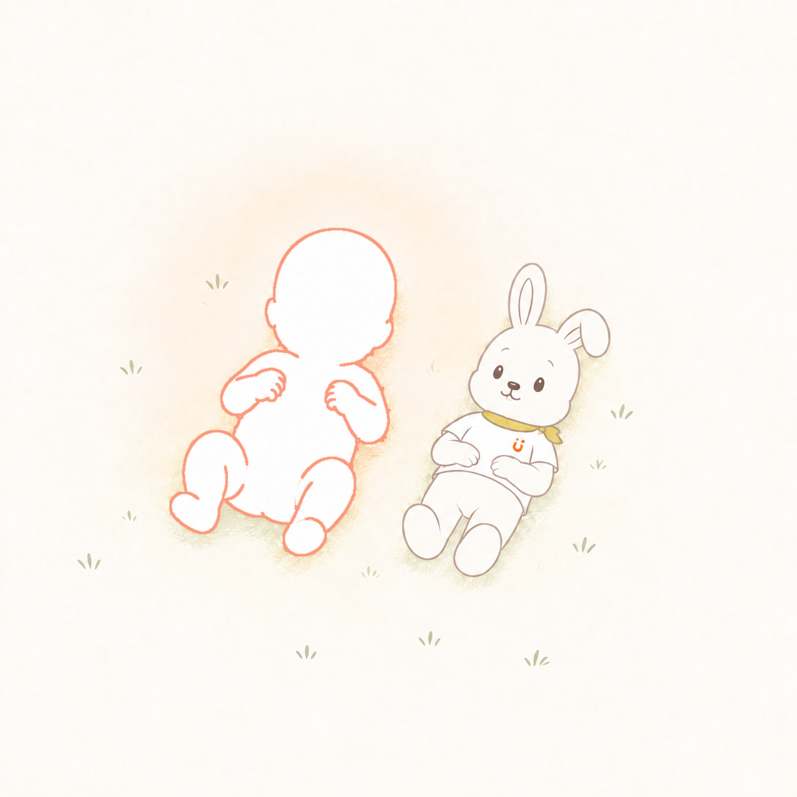

- 撮影条件: 子どもが仰向けで横になる。顔の向きや手の位置は厳密に合わせなくてよい。
- ゲンの応答: 同じ肩の高さで横になり、手をお腹へ置く。
- 用途: 休憩、外遊びの途中、何もしない時間。

### 寄りかかって座る

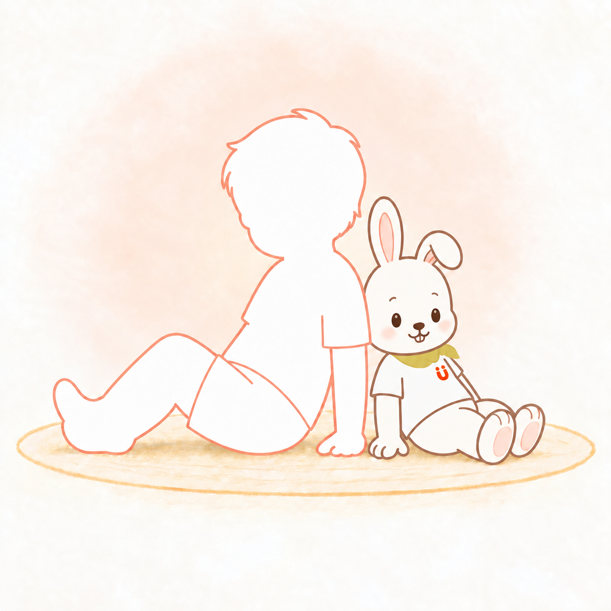

- 撮影条件: 子どもが床へ座り、手を後ろについて少し寄りかかる。
- ゲンの応答: 少し後ろで同じ向きに座り、肩または背中の線をつなぐ。
- 用途: 座位、休憩、読み聞かせや遊びの合間。

### 同じ小さなものを見る

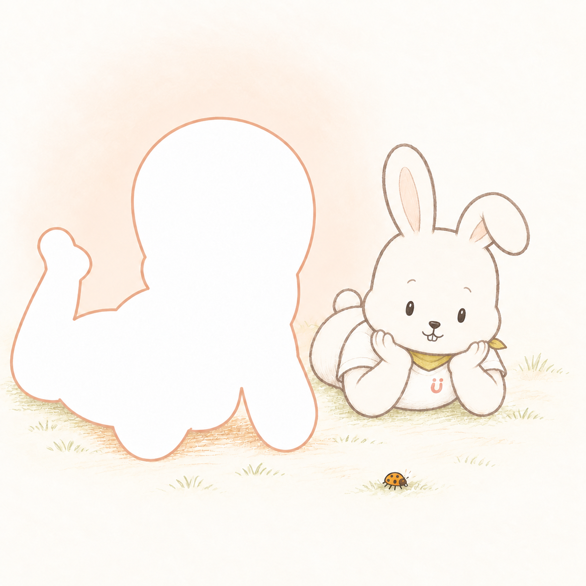

- 撮影条件: 子どもがうつ伏せで頬または顎を手に置く。
- ゲンの応答: 少し後ろで同じ姿勢になり、同じ小さな対象を見る。
- 用途: 虫、葉、石、おもちゃなどへの興味。訓練やうつ伏せ達成として扱わない。

## 16. 子どもの後ろをついていくシリーズ

保護者が日常で撮りやすい後ろ姿を前提にする。キャラクターとの精密な接触や顔の向き合わせを不要にし、子どもを前景、ゲンを一〜二歩後方へ固定する。

### 歩く子どもについていく

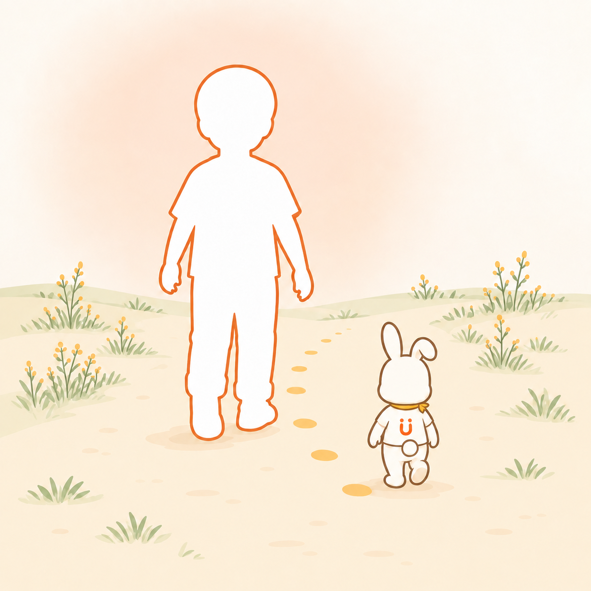

- 撮影条件: 子どもがカメラから離れる方向へ歩く後ろ姿。
- ゲンの応答: 同じ方向へ二歩ほど後ろから歩き、子どもの速度に合わせる。
- 実装上の利点: 顔切り抜きが不要。腕の位置や歩幅に多少差があっても成立する。

### 階段を一段後ろから上る

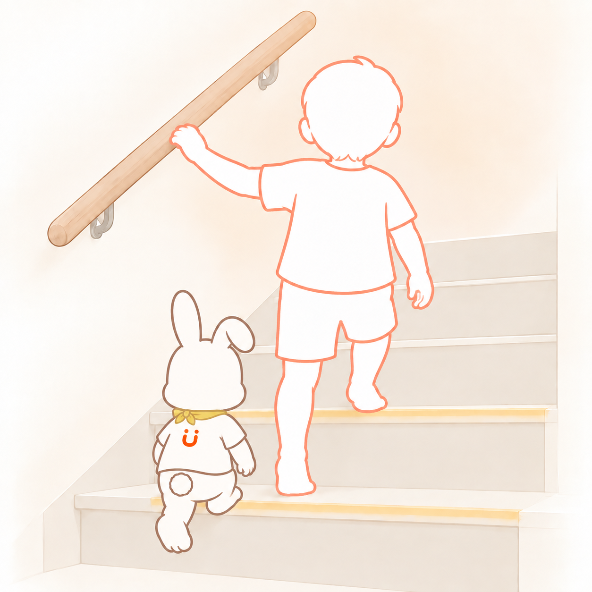

- 撮影条件: 子どもが安全な階段を上る後ろ姿。手すりが使える場合は写真内に残す。
- ゲンの応答: 一段後ろ、少し横から同じ方向へ上る。触れたり押したりせず、足元を見る。
- 実装上の利点: 階段の傾きと段差を検出し、ゲンのサイズ、位置、接地角度を合わせれば成立する。

### シリーズ共通ルール

- 子どもが常に前。ゲンが先導しない。
- ゲンは子どもより小さく、一〜二歩または一段後ろへ置く。
- 足跡をゴール、順位、標準発達の順路として使わない。
- 階段、段差、道路では、合成によって危険な行動や監督不要という印象を作らない。
- 通常の後ろ姿写真をそのまま使えることを、ポーズの美しさより優先する。

## 17. 関係の中で育つフレーム

発達を個人の技能だけでなく、人と人の間に生じる `求める → 応える`、`差し出す → 待つ`、`一緒に試す` として残す。先生はやりとりを成立させる当事者にならず、横または一歩後ろで安心、安全、待てる時間を守る。

| 案 | 関係の身体動詞 | 先生の守り方 | 軽く見る発達 |
|---|---|---|---|
| だっこして、を受け取る | 子どもが両腕を上げ、保護者が低く腕を開く | ゲンが一歩後ろで手を胸元に置いて見守る | 要求表現、応答を待つ、愛着 |
| ここまで、おいで | 子どもが保護者へ歩き、保護者がしゃがんで待つ | ゲンが一歩後ろを歩く | 自発的移動、バランス、信頼 |
| どうぞ、のあとを待つ | 一人が物を差し出し、一人が手を開く | ミモが中央で急がせず見守る | 共有、順番、応答を待つ |
| 真ん中で、つながった | 二人が左右から一つずつ積み木を置く | ルークが崩れてもよい場所を用意する | 協働、位置調整、試し直し |
| 手を出す、選ぶ | 一人が手を差し出し、一人が受けるか選ぶ | ゲンが横で低くしゃがみ、手を出さず待つ | 他者への気づき、援助提案、自己決定 |

### 関係フレームの制約

- 接触前の小さな間を残し、抱っこ、援助、受け渡しを強制された完成形にしない。
- 「助ける側／助けられる側」を固定せず、どちらの選択も見える構図にする。
- 先生は子ども同士の中央を占有せず、道具で行為を代行しない。
- 人物は淡い無輪郭シルエットとし、年齢、性別、家族構成、身体特徴を描き込みすぎない。

## 18. 代表フレームと質問で段階を拾う設計

似た遊びの発達差をすべて別画像にすると、保護者は自分の写真に合うカードを探しにくくなる。そこで、写真から一目で分かる**身体動作・相手・場面が変わる場合だけ画像を分け**、同じ構図の中で起きる遊び方の違いは**代表画像一枚と質問**で拾う。

### 画像を分ける基準

- 仰向け、寝返り、座位、歩行など、子どもの姿勢が明確に変わる。
- 一人遊び、親子、子ども同士など、関係する相手が変わる。
- 階段、滑り台、砂場など、撮影場所や安全条件が変わる。
- 渡す、待つ、追うなど、写真を成立させる中心動詞が変わる。

### 一枚と質問で拾う基準

- 積み木を運ぶ、置く、積む、並べる、見立てるなど、同じ素材の使い方が連続する。
- 表情、声、身体、道具、他児、後から再現、自分の形など、模倣の対象や複雑さが変わる。
- ごっこのふり、見立て、手順、役割、物語など、写真だけでは内的な意味を判定しにくい。
- 繰り返す、方法を変える、予想するなど、前後の時間を見ないと分からない。

### 現在の15の遊び家族

| 家族 | 代表画像で見せること | 保護者へ聞く中心質問 |
|---|---|---|
| からだと姿勢 | 身体の形が変わる途中 | 今日は、どんな身体の使い方をしていましたか？ |
| 移動する | 行きたい方へ進む | 今日は、どうやって移動していましたか？ |
| 公園と順番 | 見る、待つ、やってみる | 遊具へ近づいたとき、どんな様子でしたか？ |
| ボール | 離す、送る、受ける | 今日は、ボールをどう楽しんでいましたか？ |
| 見る・伝える | 興味の先を分け合う | 興味のあるものを、どう伝えていましたか？ |
| まねる・生み出す | 子どもが見本になる | どんな「まね」が起きていましたか？ |
| 隠す・見つける | 見えない相手を探す | 今日は、隠す側と探す側のどちらでしたか？ |
| ごっこ | ふりから物語が始まる | 遊びの中で、どんな物語がありましたか？ |
| 感覚遊び | 自分で触り方を選ぶ | どんな触り方をしていましたか？ |
| 探求・原因と結果 | 動作のあとの変化を見る | 動かしたあと、どんな様子でしたか？ |
| 積み木・構成 | 並べた物に意味を与える | 今日は、積み木をどう使っていましたか？ |
| 描く・作る | 跡が形や物語になる | 紙の上で、何を楽しんでいましたか？ |
| 本・ことば | めくる先を見て伝える | 本を見ながら、何をしていましたか？ |
| 日常生活 | 自分でする、助けを求める | 今日は、どこを自分でしていましたか？ |
| 関係・ルール | 求める、応える、待つ | 相手との間で、何が起きていましたか？ |

`participatory-growth-frames/index.html` の冒頭では、15家族を一本の発達順にせず、次の5軸へ分けて見せる。軸同士は並行し、前後関係をつけない。各軸の中だけを、おおよそ入口から複雑な遊びへ並べる。

| 軸 | 軸内の並び |
|---|---|
| 身体・姿勢・移動 | からだと姿勢 → 移動する → ボール → 公園と順番 |
| 感覚・認知・探索 | 感覚遊び → 探求・原因と結果 → 隠す・見つける → 積み木・構成 |
| コミュニケーション・模倣・象徴 | 見る・伝える → まねる・生み出す → 本・ことば → ごっこ |
| 手指・生活・表現 | 日常生活 → 描く・作る |
| 社会性・情緒・関係 | 関係・ルール |

たとえば積み木は言葉より前から始まり得るため、コミュニケーション軸の後ろへ置かない。下部のキャラクター別一覧は、実際の写真に合わせて選ぶ身体ポーズのバリエーションとして残す。

### HTMLでの見せ分け

別HTMLへ複製せず、同一ページを二つのタブに分ける。

- **発達軸から見る**: 5軸、15家族、代表画像、質問と回答候補を表示する。
- **キャラクターから見る**: ゲン、ミモ、ルーク、関係フレームごとの全画像を表示する。

一つの画像や文言を二重管理せず、修正を両方の見方へ反映できることを優先する。キャラクターごとのアンカーURLは残し、直接開いた場合はキャラクタータブを表示する。

## 19. しゃがむ・拾う

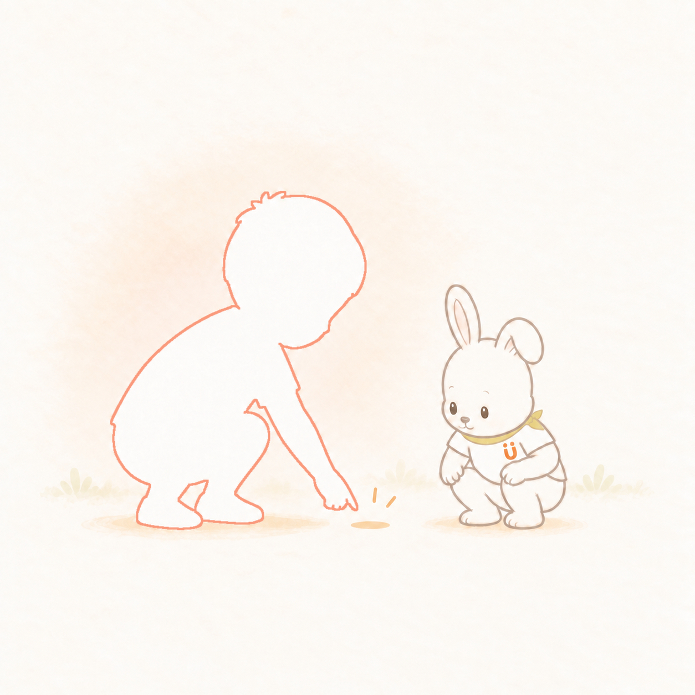

- 発達軸: **身体・姿勢・移動 → からだと姿勢**
- 中心動詞: 立位から腰を下げる／両足で支える／床へ手を伸ばす／立位へ戻る
- 写真条件: 両足を少し開いた深いしゃがみ。片手を床の物へ伸ばし、反対の腕でバランスを取る。
- ゲンの応答: 隣で同じ高さへしゃがむ。物を先に取らず、身体を支えず、子どもの発見を見る。
- 対象物: 実際の写真にある葉、石、おもちゃなどを使う。フレーム側は小さな淡い影だけにする。

質問は「しゃがんだとき、どんな様子でしたか？」とし、`手を床についた`、`支えにつかまった`、`両足でしゃがんだ`、`物を拾った`、`しゃがんだまま遊んだ`、`自分で立ち戻った`から複数選択できるようにする。
