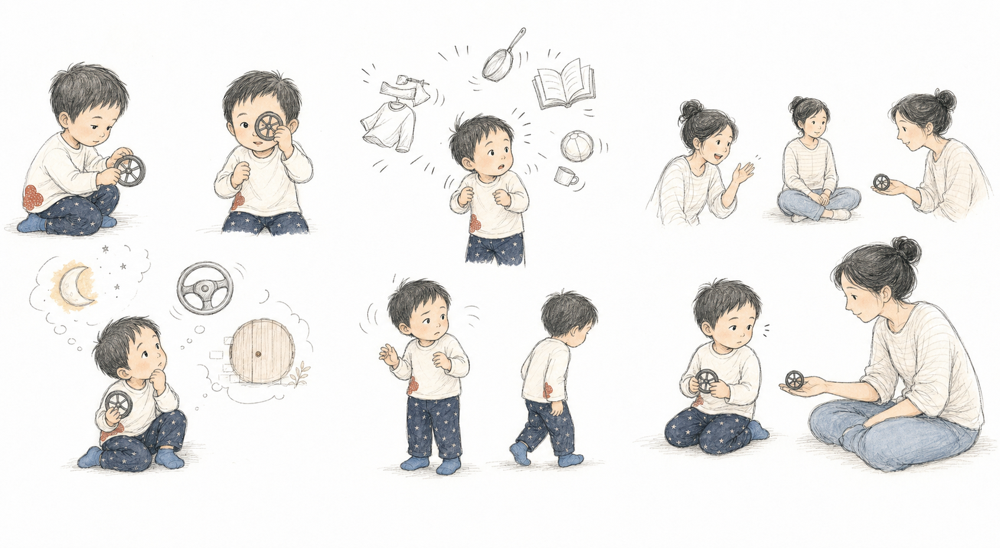
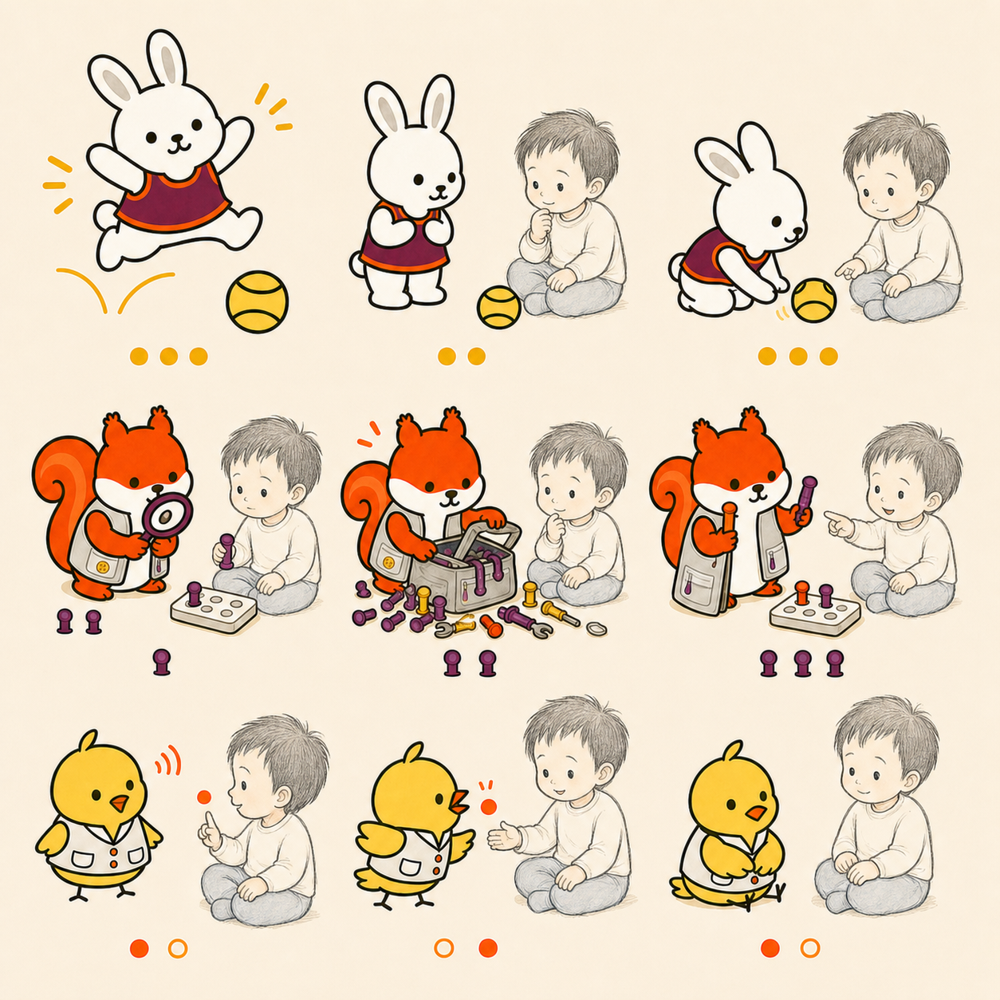
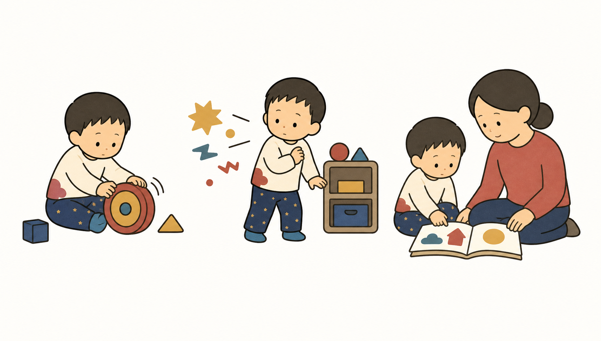
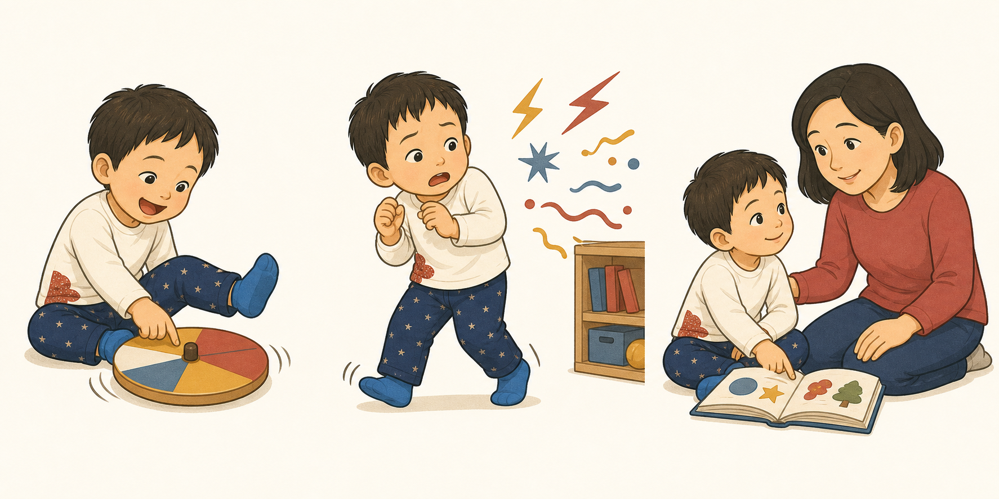
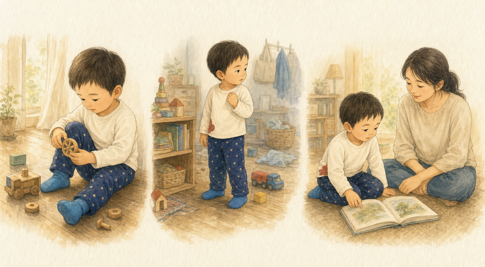

# HugMap Stories 画風意思決定シート

更新日: 2026-07-29

状態: **3案を比較し、候補Cを主案として検証中**

決定の記録先: [`open-decisions.md`](open-decisions.md)

## 1. 今回決めること

絵本、アイコン、LINEスタンプへ展開できる共通の画風を決める。

現在の個人的な好み:

- **人物は線画・スケッチ型が好き。**
- **動物は記号型、またはキャラクター・アニメーション型との組み合わせが好き。**

この好みを尊重し、最終候補を次の3案へ絞る。

| 候補 | 人物 | 動物 | 一言でいうと |
|---|---|---|---|
| **A** | 線画・スケッチ型 | 記号型 | 静かな子どもの思考と、覚えやすい先生 |
| **B** | 線画・スケッチ型 | キャラクター・アニメーション型 | 静かな子どもと、よく動く先生 |
| **C** | 線画・スケッチ型 | 動いて遊ぶ記号型 | 静かな子どもと、反応を受けて行動を変える先生 |

## 2. 共通する人物表現



人物は細い線と少ない色で描き、表情を大きく説明しない。指、肩、視線、身体の向き、小さな連続場面によって、子どもの考えや保護者の迷いを見せる。

この方式がHugMapに合う理由:

- 発語以外の小さなサインを描ける。
- 「できた／できない」より、途中の変化を見せられる。
- 子どもの想像や複数の可能性を並べられる。
- 読者が内面を決めつけずに読み込める。

注意点:

- 顔や線を細かくしすぎると、スマートフォンでは読みにくい。
- 絵本本文では、一画面に置く連続像を3つ程度までにする。
- 肌、服、重要な道具だけに限定色を使い、視線の中心を作る。

## 3. 候補A――線画の人物＋記号型の動物


### 見え方

人物は生活と思考を担い、動物は「傾聴」「探索」「応援」などの見つけ方を象徴する。人物と動物の表情を競わせず、動物の耳、羽、尻尾、姿勢で個性を出す。

### 評価

| 観点 | 評価 | 理由 |
|---|---:|---|
| 世界観との相性 | **5/5** | 子どもの内面に余白を残し、先生の役割は明確になる |
| 一冊の統一感 | **4/5** | 線の太さが異なるため、共通色と紙質が必要 |
| 幼い読者の認識 | **5/5** | 動物を小さくしても識別しやすい |
| アイコン・スタンプ | **5/5** | 記号型をそのまま展開できる |
| 感情・動きの幅 | **3/5** | 動物の表情を固定すると、仕草の設計が重要になる |
| 制作・再現性 | **5/5** | 基本形を固定しやすく、複数の制作者でも揃えやすい |

### 向いている作品

- ことばになる前のサイン
- 感覚や身体の小さな変化
- 保護者が子どもの見方を変える物語
- 問いを残して終わる静かな作品

## 4. 候補B――線画の人物＋キャラクター型の動物


### 見え方

人物は静かに観察され、動物は身体を大きく使って物語を進める。読み聞かせで「誰が何をしたか」が分かりやすく、先生ごとの性格も出しやすい。

### 評価

| 観点 | 評価 | 理由 |
|---|---:|---|
| 世界観との相性 | **4/5** | 明るさは合うが、先生が子どもより目立つ可能性がある |
| 一冊の統一感 | **3/5** | 動物の太い線と人物の細い線の差が強い |
| 幼い読者の認識 | **5/5** | 動きと感情をすぐ理解できる |
| アイコン・スタンプ | **4/5** | スタンプに強いが、小アイコンでは表情が潰れやすい |
| 感情・動きの幅 | **5/5** | 遊び、応援、驚き、喜びを大きく描ける |
| 制作・再現性 | **3/5** | ポーズ、表情、関節の一貫した作画設計が必要 |

### 向いている作品

- うさぎ先生の身体遊び
- 動物チームが協力する冒険
- 明快な出来事が連続する作品
- LINEスタンプや短いアニメーション

## 5. 候補C――線画の人物＋動いて遊ぶ記号型の動物



### 見え方

動物の形は記号的に保ち、表情を増やす代わりに、反復する色や物、距離、姿勢の変化で性格を見せる。先生の得意技ではなく、**子どもの反応を受けて待つ、選び直す、合わせる過程**を3場面で描く。

### 評価

| 観点 | 評価 | 理由 |
|---|---:|---|
| 世界観との相性 | **5/5** | 支援を「先生がしてあげること」ではなく、やりとりとして描ける |
| 一冊の統一感 | **5/5** | 人物と動物の線の差を、静と動の役割差として使える |
| 幼い読者の認識 | **5/5** | 形、限定色、反復する道具で先生を追いやすい |
| アイコン・スタンプ | **5/5** | 単独ポーズにも、3コマの小さな変化にも展開できる |
| 感情・動きの幅 | **4/5** | 大げさな表情に頼らず、身体と関係性で変化を出せる |
| 制作・再現性 | **4/5** | 各先生に「3場面の文法」を固定する必要がある |

## 6. 比較するときの重要な違い

| 問い | 候補A | 候補B | 候補C |
|---|---|---|---|
| 読者は子どもの内側を想像できるか | **強い** | 動物が答えを先に示す場合がある | **強い。先生の行動変化だけを描く** |
| 動物の個性が一目で分かるか | 形と持ち物 | 形、表情、大きな動き | **形、反復記号、行動の順序** |
| 先生が子どもの主役性を奪わないか | **抑えやすい** | 彩度と動きの調整が必要 | **子どもの反応が先生の次の動きを決める** |
| 小さい画面で使えるか | **強い** | 表情の細部を減らす必要がある | **強い** |
| シリーズの楽しさを出せるか | 静かで温かい | 明るく活発 | **静けさの中に発見と愛嬌がある** |

## 7. 現時点の推奨

基本案は、**候補C「線画の人物＋動いて遊ぶ記号型の動物」**とする。

動物の基本形は候補Aの記号性を保ち、候補Bの大きな表情ではなく、次の小さな行動変化を取り入れる。

- ことり先生は、羽を開く、閉じる、ぱたぱたする。
- りす先生は、しゃがむ、覗く、道具を二つ差し出す。
- うさぎ先生は、跳ぶ、止まる、小さな応援ポーズをする。
- 顔の変化は小さくし、感情は耳、羽、尻尾、姿勢、距離で表す。

つまり、最終候補は次の設計になる。

```text
人物
＝細い線＋限定色＋小さな連続動作

動物
＝単純な記号形＋限定色＋大きく読める身体動作

共通する橋
＝同じ白い紙、同じ限定色、同じ影の弱さ
```

これは曖昧な折衷ではない。**形は記号、性格は子どもとの関係の変化、感情は身体と距離**という役割分担である。

## 8. 最終判断のために作る1見開き

次は候補Cで、子どもの反応によって先生の行動が変わる1見開きを作る。

試作場面:

> 子どもが床で車輪を回している。ことり先生が少し離れた斜め横へ座り、子どもの指の動きを小さくまねる。二人は目を合わせていない。

比較時は、次の5項目を各5点で採点する。

1. 最初に子どもへ目が向くか。
2. ことり先生の「聴く」が言葉なしで分かるか。
3. 子どもの気持ちを絵が決めつけていないか。
4. スマートフォンの幅でも指と羽の動きが見えるか。
5. この組み合わせで別の先生も見たくなるか。

合計点だけで決めず、「長く描き続けたいか」と「自分のシリーズに見えるか」を最後の判断にする。

## 9. 今回は主案にしない組み合わせ

| 組み合わせ | 主案にしない理由 |
|---|---|
| 人物も動物も記号型 | 統一しやすいが、身体や視線の細かな観察が弱くなる |
| 人物も動物もアニメーション型 | 明快だが、感情や成功を説明しすぎる可能性がある |
| 水彩人物＋強いアニメーション動物 | 動物が画面の主役になりやすい |
| 線画人物＋素材感の強いコラージュ動物 | 動物だけ完成品、人物だけ下描きに見える可能性がある |

水彩・生活描写型とコラージュ・素材型は捨てない。背景、光、紙面の色面として部分的に使い、人物と動物の基本造形を上書きしない。

## 10. 参考用：人物4案

| 記号・アイコン型 | キャラクター・アニメーション型 |
|---|---|
|  |  |

| 水彩・生活描写型 | 線画・スケッチ型 |
|---|---|
|  |  |
